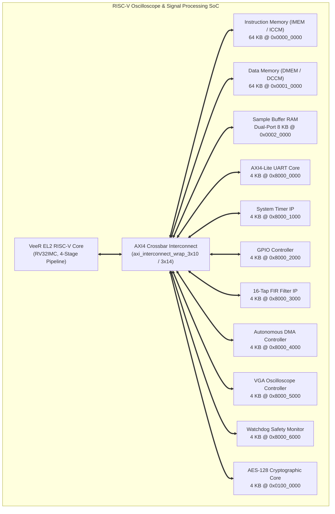
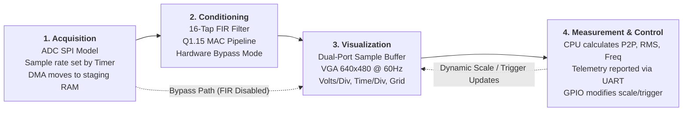
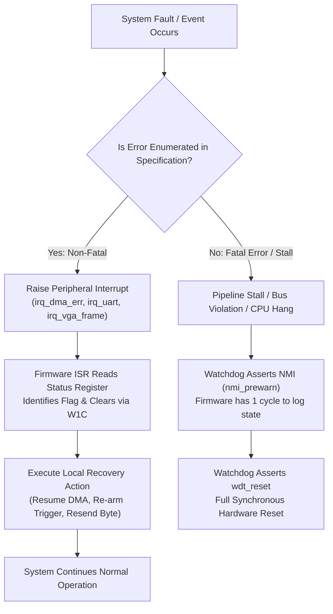
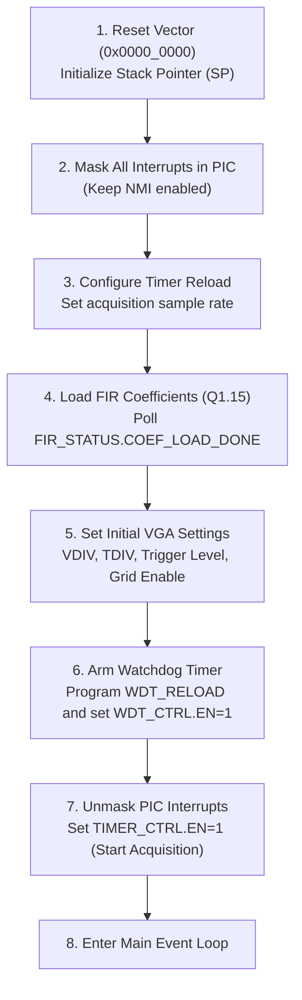

# RISC-V Real-Time Signal Acquisition, FIR Filtering, and VGA Oscilloscope SoC

[-blue.svg)](rtl/veer_el2/README.md)
[-brightgreen.svg)](rtl/interconnect/README.md)
[](rtl/README.md)
[](#12-simulation--verification-guide)
[](#12-simulation--verification-guide)

An advanced System-on-Chip (SoC) architecture built around an industrial-grade **32-bit RISC-V processor core (VeeR EL2)**, high-bandwidth **AXI4 crossbar interconnect**, hardware **FIR filter accelerator**, and a dedicated **VGA oscilloscope display controller**. 

The design decouples high-speed streaming signal acquisition, digital filtering, and real-time pixel rendering from the CPU, allowing the processor to handle sequencing, runtime controls, and mathematical signal measurements (Peak-to-Peak, RMS, and Frequency estimation) reported over UART.

---

## 🧭 Quick Navigation Hub

| Section | Description | Direct Link |
|---|---|---|
| **Project Documentation** | Authoritative architecture spec, abstract, register sheets, and IP diagrams | [Jump to Documentation](#-project-documentation--reference-specifications) |
| **Project Overview** | Problem statement, abstract, and architecture highlights | [Jump to Section 1](#1-problem-statement--abstract) |
| **System Architecture** | Top-level block diagrams, data-flow pipeline, and clock domains | [Jump to Section 2](#2-system-architecture--block-diagrams) |
| **Integrated IP Cores** | Dedicated README guides for VeeR EL2, AXI Interconnect, UART, AES | [Jump to Section 3](#3-integrated-ip-cores--individual-readmes) |
| **Boundary & Internal Signals** | Complete pinout and cross-IP signal definitions | [Jump to Section 4](#4-system-signal-definitions) |
| **Control & Data Paths** | Hardware/software control paths (CP1–CP7) and data paths (DP1–DP6) | [Jump to Section 5](#5-control--data-paths) |
| **Error Handling & Recovery** | Non-fatal W1C recovery matrix vs. fatal watchdog resets | [Jump to Section 6](#6-error-handling--fault-recovery-matrix) |
| **Interrupt Hierarchy** | Complete IRQ 0–7 table, classes, priority, and NMI contract | [Jump to Section 7](#7-interrupt-hierarchy--vector-map) |
| **Memory & Register Maps** | Base addresses, offsets, bitfields, and register classifications | [Jump to Section 8](#8-memory-map--register-specifications) |
| **Firmware Application** | Boot flow, interrupt-driven main loop, and measurement math | [Jump to Section 9](#9-firmware-application-specification) |
| **Verification & Simulation** | Synopsys VCS compilation, test suites, and Verdi waveform debug | [Jump to Section 10](#10-simulation--verification-guide) |
| **Repository Layout** | Clean structural tree and file navigation | [Jump to Section 11](#11-repository-directory-structure) |

---

## 📚 Project Documentation & Reference Specifications

The repository includes extensive architectural contracts, specification documents, register interface sheets, and diagrams stored within the respective subdirectories. The table below maps all reference documentation available in the codebase:

| Document / Resource | File Location | Format | Description & Contents |
|---|---|:---:|---|
| **SoC Architecture Document** | [`doc/ArchitectureDocument.md`](doc/ArchitectureDocument.md) | Markdown | **Authoritative Specification:** Comprehensive 516-line specification of the SoC, memory map, register bitfields, control/data paths, error handling, and verification requirements. |
| **SoC Integration Report** | [`doc/SOC_INTEGRATION_REPORT.md`](doc/SOC_INTEGRATION_REPORT.md) | Markdown | **VeeR EL2 Core Integration:** Detailed report on processor integration, 64-to-32 AXI bus adapters, bug resolutions, and 15/15 passed VCS simulation results. |
| **Project Abstract** | [`doc/Project_Abstract.docx`](doc/Project_Abstract.docx) | Word Doc | Formal academic project abstract defining the problem statement, motivations, and selected IP blocks. |
| **AES Register Specification** | [`rtl/aes_core-master/aes_axi_register_spec.txt`](rtl/aes_core-master/aes_axi_register_spec.txt) | Plain Text | Complete hardware register interface, bit definitions, and NIST FIPS-197 byte-ordering alignment for the AES core. |
| **AES Cipher Specification** | [`rtl/aes_core-master/doc/aes.pdf`](rtl/aes_core-master/doc/aes.pdf) | PDF Document | Mathematical description and hardware block diagram of the AES-128 encryption and decryption algorithm. |
| **AES Verdi Waveform Verification** | [`rtl/aes_core-master/output_verdi.png`](rtl/aes_core-master/output_verdi.png) | PNG Image | Synopsys Verdi waveform verification capture demonstrating 10-round cipher execution and AXI handshakes. |
| **AXI UART Architecture Diagram** | [`rtl/axi_uart/doc/axi-uart.png`](rtl/axi_uart/doc/axi-uart.png) | PNG Image | Hardware block diagram illustrating UART FIFOs, baud rate generator, and AXI-Lite bus interface. |
| **AXI UART Visio Diagram Source** | [`rtl/axi_uart/doc/axi-uart.vsdx`](rtl/axi_uart/doc/axi-uart.vsdx) | MS Visio | Vector source file for the UART peripheral block diagram. |
| **AXI UART Upstream Guide** | [`rtl/axi_uart/doc/README.md`](rtl/axi_uart/doc/README.md) | Markdown | Upstream documentation and CI workflow descriptions for the AXI UART core. |
| **VeeR Configuration Guide** | [`rtl/veer_el2/configs/README.md`](rtl/veer_el2/configs/README.md) | Markdown | Configuration instructions for generating custom core snapshots and setting DCCM/ICCM sizes. |
| **SoC Memory Map Linker Script** | [`rtl/veer_el2/snapshots/default/link.ld`](rtl/veer_el2/snapshots/default/link.ld) | GNU Linker | Linker script defining the memory regions (`imem`, `dmem`, `sample_buffer`, and MMIO peripherals). |
| **Firmware Hardware Defines** | [`rtl/veer_el2/snapshots/default/defines.h`](rtl/veer_el2/snapshots/default/defines.h) | C Header | Hardware base addresses and register bitmasks for C firmware development. |
| **Verdi Waveform Configuration** | [`run/uart_signals.rc`](run/uart_signals.rc) | Signal Config | Pre-configured Verdi signal hierarchy configuration for debugging UART transmission and interconnect traffic. |

---

## 1. Problem Statement & Abstract

### 1.1 Problem Statement
Embedded signal-processing SoC designs often terminate their data path at a numeric or serial interface—such as a stream of filtered numbers emitted over UART. While adequate to confirm arithmetic correctness in simulation, this approach omits the most crucial element of signal analysis: **interactive visual observation**. 

Bench oscilloscopes enable engineers to dynamically modify Volts/Division, Time/Division, trace offsets, and trigger thresholds to diagnose signal anomalies in real time. Academic RISC-V SoC architectures rarely provide hardware-accelerated display rendering; when present, the CPU is frequently overwhelmed by per-sample copy operations or pixel-by-pixel rendering loops.

### 1.2 Proposed Solution
This project bridges the gap by implementing an integrated SoC that acquires an analog-style signal (via a behavioral SPI/ADC model in simulation), filters it through a dedicated hardware **FIR filter engine**, and renders it as an oscilloscope-style waveform with a calibrated reference grid directly on a **VGA display (640x480 @ 60 Hz)**. 

The RISC-V processor is maintained entirely off the streaming data path:
- **Autonomous Hardware Datapath:** ADC $\rightarrow$ DMA $\rightarrow$ FIR Filter $\rightarrow$ Sample Buffer $\rightarrow$ VGA Controller.
- **CPU Control Path:** Configures sampling rates, sets display scales and triggers, toggles filter bypass, executes statistical measurement routines (Peak-to-Peak, RMS, Frequency), and outputs diagnostic telemetry over UART.

---

## 2. System Architecture & Block Diagrams

The architecture separates control and configuration (bus-mapped transactions) from high-throughput streaming sample movement.

### 2.1 Bus & Memory-Map Fabric View

Every block connects to the memory-mapped interconnect. The CPU uses this bus for instruction fetches and peripheral configuration:



### 2.2 Cross-IP Data, Control & Interrupt Connectivity

Streaming samples move across dedicated hardware interfaces without consuming CPU bus cycles:

```mermaid
flowchart LR
    ADC["ADC / SPI Behavioral Model<br/>(Simulation Stimulus)"] -->|Raw SPI Samples| DMA["DMA Controller Engine"]
    TIMER["System Timer"] -->|sample_tick pulse| DMA
    DMA -->|Raw Sample Stream| FIR["Hardware FIR Filter"]
    FIR -->|Filtered Stream| DMA
    DMA -->|DMA Write Port| SBUF["Dual-Port Sample Buffer"]
    SBUF -->|VGA Read Port| VGA["VGA Controller Engine"]
    VGA -->|HSYNC, VSYNC, RGB444| DISP["VGA Monitor / Checker"]

    GPIO["GPIO User Buttons"] -->|Scale / Trig Cmds| PIC["Core PIC / Interrupts"]
    UART["AXI UART"] -->|Telemetry & Logs| HOST["Host Console / Terminal"]

    TIMER -.->|irq_timer| PIC
    DMA -.->|irq_dma_done / irq_dma_err| PIC
    UART -.->|irq_uart| PIC
    GPIO -.->|irq_gpio| PIC
    VGA -.->|irq_vga_frame| PIC
    FIR -.->|irq_fir| PIC
    WDT["Watchdog Timer"] -.->|nmi_prewarn| PIC
    PIC ==> CPU["VeeR EL2 Core"]

    WDT ==>|wdt_reset (Hard Reset)| CPU
    WDT ==>|wdt_reset| BUS["AXI Interconnect"]
```

### 2.3 Data-Flow Pipeline



### 2.4 Clock & Reset Domains

| Domain | Frequency | Clock Source | Consuming Modules |
|---|---|---|---|
| **`clk_sys`** | 100 MHz | Primary system oscillator / testbench generator | CPU, AXI Interconnect, IMEM, DMEM, Sample Buffer (Write Port), UART, Timer, GPIO, FIR, DMA, Watchdog, AES Core |
| **`clk_vga`** | 25.175 MHz | Dedicated pixel clock PLL / testbench clock | VGA Oscilloscope Controller timing and Sample Buffer (Read Port) |
| **`rst_n`** | Asynchronous / Synchronized | Active-low system reset, driven by testbench power-on reset OR Watchdog timeout pulse (`wdt_reset`) | All system blocks |

> [!IMPORTANT]
> **Clock Domain Crossing (CDC):** The Sample Buffer is implemented as an asynchronous dual-clock RAM. The write port operates strictly on `clk_sys`, while the read port operates on `clk_vga`. Gray-coded pointers and multi-stage synchronizers prevent metastability.

---

## 3. Integrated IP Cores & Individual READMEs

Click any IP below to explore its dedicated architecture manual, pinout, register definitions, and verification steps:

```
honours_project_soc-main/rtl/
├── veer_el2/           ──► [VeeR EL2 RISC-V Processor Core](rtl/veer_el2/README.md)
├── interconnect/       ──► [AXI4 Crossbar Interconnect (3x10 / 3x14)](rtl/interconnect/README.md)
├── axi_uart/           ──► [AXI4-Lite 16550-Compatible UART](rtl/axi_uart/README.md)
├── timer/              ──► [Acquisition Rate Timer Core](rtl/timer/README.md)
├── gpio/               ──► [16-Bit General Purpose I/O Core](rtl/gpio/README.md)
├── fir_filter/         ──► [16-Tap Q1.15 FIR Digital Filter](rtl/fir_filter/README.md)
├── dma_controller/     ──► [Autonomous Acquisition DMA Controller](rtl/dma_controller/README.md)
├── sample_buffer/      ──► [4096x16 True Dual-Port Sample Buffer](rtl/sample_buffer/README.md)
├── vga_controller/     ──► [640x480 Oscilloscope VGA Display Controller](rtl/vga_controller/README.md)
├── watchdog/           ──► [System Watchdog Safety Monitor](rtl/watchdog/README.md)
├── aes_core-master/    ──► [AES-128/256 Cryptographic Accelerator (Experimental)](rtl/aes_core-master/README.md)
└── README.md           ──► [RTL Subsystem & Peripheral Integration Hub](rtl/README.md)
```

### IP Summary Matrix

| IP Core | Directory | Provenance / Origin | Primary Role | Bus Interface | Dedicated README | References & Artifacts |
|---|---|:---:|---|---|:---:|---|
| **VeeR EL2 Core** | `rtl/veer_el2/` | **Open-Source**<br/>(CHIPS Alliance / WD, Apache 2.0) | Central CPU executing RTOS/firmware, sequencing, and measurements | Dual AXI4 Master (IFU + LSU) | [**View README**](rtl/veer_el2/README.md) | • [Configs Manual](rtl/veer_el2/configs/README.md)<br/>• [Linker Script](rtl/veer_el2/snapshots/default/link.ld)<br/>• [Header Defines](rtl/veer_el2/snapshots/default/defines.h) |
| **AXI Interconnect** | `rtl/interconnect/` | **Open-Source**<br/>(Alex Forencich, BSD 2-Clause) | Non-blocking crossbar routing memory and peripheral transactions | 3-Master x 10/14-Slave AXI4 | [**View README**](rtl/interconnect/README.md) | • [Wrapper Generator](scripts/axi_interconnect_wrap.py)<br/>• [3x10 Wrapper](rtl/interconnect/axi_interconnect_wrap_3x10.v)<br/>• [3x14 Wrapper](rtl/interconnect/axi_interconnect_wrap_3x14.v) |
| **AXI UART** | `rtl/axi_uart/` | **Open-Source**<br/>(BSC / Abraham J. Ruiz R., GPL-3.0) | 16550 serial console for diagnostics and measurement reporting | AXI4-Lite Slave | [**View README**](rtl/axi_uart/README.md) | • [Block Diagram (PNG)](rtl/axi_uart/doc/axi-uart.png)<br/>• [Source Diagram (VSDX)](rtl/axi_uart/doc/axi-uart.vsdx)<br/>• [Upstream Guide](rtl/axi_uart/doc/README.md) |
| **Acquisition Timer** | `rtl/timer/` | **Custom Developed**<br/>(Honours Project Spec §8.5) | Pacing generator producing single-cycle `sample_tick` strobes | AXI4-Lite Slave (`0x8000_1000`) | [**View README**](rtl/timer/README.md) | • [Timer RTL](rtl/timer/timer.sv)<br/>• [Unit Testbench](tb/tb_timer.sv)<br/>• [Filelist](run/filelist_timer.f) |
| **GPIO Controller** | `rtl/gpio/` | **Custom Developed**<br/>(Honours Project Spec §8.8) | Captures user buttons with double-flop sync, edge IRQ, and drives LEDs | AXI4-Lite Slave (`0x8000_2000`) | [**View README**](rtl/gpio/README.md) | • [GPIO RTL](rtl/gpio/gpio.sv)<br/>• [Unit Testbench](tb/tb_gpio.sv)<br/>• [Filelist](run/filelist_gpio.f) |
| **FIR Filter** | `rtl/fir_filter/` | **Custom Developed**<br/>(Honours Project Spec §8.7) | 16-tap Q1.15 MAC digital signal filter with bypass mode | AXI4-Lite Slave (`0x8000_3000`) | [**View README**](rtl/fir_filter/README.md) | • [FIR RTL](rtl/fir_filter/fir_filter.sv)<br/>• [Unit Testbench](tb/tb_fir_filter.sv)<br/>• [Filelist](run/filelist_fir.f) |
| **DMA Controller** | `rtl/dma_controller/` | **Custom Developed**<br/>(Honours Project Spec §8.6) | Autonomous SPI master fetch and streaming pipeline to FIR and RAM | AXI4-Lite Slave (`0x8000_4000`) | [**View README**](rtl/dma_controller/README.md) | • [DMA RTL](rtl/dma_controller/dma_controller.sv)<br/>• [Unit Testbench](tb/tb_dma_controller.sv)<br/>• [ADC Model](tb/adc_model.sv) |
| **Sample Buffer** | `rtl/sample_buffer/` | **Custom Developed**<br/>(Honours Project Spec §8.4) | 4096x16 True Dual-Port asynchronous RAM (DMA write, CPU/VGA read) | AXI4-Lite Slave (`0x0002_0000`) | [**View README**](rtl/sample_buffer/README.md) | • [SBUF RTL](rtl/sample_buffer/sample_buffer.sv)<br/>• [Unit Testbench](tb/tb_sample_buffer.sv)<br/>• [Filelist](run/filelist_sample_buffer.f) |
| **VGA Controller** | `rtl/vga_controller/` | **Custom Developed**<br/>(Honours Project Spec §8.9) | 640x480 @ 60 Hz oscilloscope display generator with graticule grid | AXI4-Lite Slave (`0x8000_5000`) | [**View README**](rtl/vga_controller/README.md) | • [VGA RTL](rtl/vga_controller/vga_controller.sv)<br/>• [Unit Testbench](tb/tb_vga_controller.sv)<br/>• [Filelist](run/filelist_vga.f) |
| **Watchdog Timer** | `rtl/watchdog/` | **Custom Developed**<br/>(Honours Project Spec §8.10) | Liveness monitor with key-reload, NMI pre-warn, and hard reset trip | AXI4-Lite Slave (`0x8000_6000`) | [**View README**](rtl/watchdog/README.md) | • [Watchdog RTL](rtl/watchdog/watchdog.sv)<br/>• [Unit Testbench](tb/tb_watchdog.sv)<br/>• [Filelist](run/filelist_watchdog.f) |
| **Subsystem Top** | `rtl/axi_interconnect_uart_top.v`| **Custom Integrated** | Pre-integrated subsystem connecting 3 masters to UART and 9 external slave ports | AXI4 Subsystem Wrapper | [**View README**](rtl/README.md) | • [Top Subsystem RTL](rtl/axi_interconnect_uart_top.v)<br/>• [VCS Script](run/run_vcs_uart_interconnect.sh)<br/>• [Signal Layout](run/uart_signals.rc) |
| **AES Core** *(Experimental)* | `rtl/aes_core-master/` | **Open-Source**<br/>(Secworks, BSD 2-Clause) | **Educational/Experimental:** Interfacing slave IP to AXI CSRs (Not required for main signal/VGA pipeline) | AXI4-Lite Slave (`0x0100_0000`) | [**View README**](rtl/aes_core-master/README.md) | • [Register Spec (TXT)](rtl/aes_core-master/aes_axi_register_spec.txt)<br/>• [Algorithm Spec (PDF)](rtl/aes_core-master/doc/aes.pdf)<br/>• [Verdi Waveform (PNG)](rtl/aes_core-master/output_verdi.png) |

> [!NOTE]
> **Experimental / Educational Scope of the AES Core:**
> The AES Core (`rtl/aes_core-master/`) is **not a functional requirement** of the primary real-time signal acquisition, FIR filtering, and VGA oscilloscope display pipeline. It is incorporated into the codebase strictly for **experimental learning purposes**—specifically to explore and demonstrate how to attach a slave IP core to an AXI interconnect, map and decode 32-bit Control and Status Registers (CSRs), manage valid/ready handshaking, and configure data processing flows over memory-mapped I/O.

---

## 4. System Signal Definitions

### 4.1 External SoC Boundary Pins (`soc_top`)

| Signal | Direction | Width | Clock Domain | Description |
|---|---|---|---|---|
| `clk_sys` | Input | 1 | — | Main system clock (100 MHz) |
| `clk_vga` | Input | 1 | — | VGA pixel clock (25.175 MHz for 640x480 @ 60 Hz) |
| `rst_n` | Input | 1 | Asynchronous | Active-low master reset |
| `adc_spi_sck` | Output | 1 | `clk_sys` | SPI Serial Clock driven to ADC model |
| `adc_spi_mosi` | Output | 1 | `clk_sys` | SPI Master-Out Slave-In configuration line |
| `adc_spi_miso` | Input | 1 | `clk_sys` | SPI Master-In Slave-Out sample stream from ADC |
| `adc_spi_cs_n` | Output | 1 | `clk_sys` | Active-low SPI chip select |
| `uart_tx` | Output | 1 | `clk_sys` | Serial telemetry and measurement output |
| `uart_rx` | Input | 1 | `clk_sys` | Serial command input |
| `gpio_in[7:0]` | Input | 8 | `clk_sys` | User inputs (scale up/down, trigger level, freeze/hold, bypass toggle) |
| `gpio_out[7:0]`| Output | 8 | `clk_sys` | Status LEDs (acquiring, filter active, triggered, error state) |
| `vga_hsync` | Output | 1 | `clk_vga` | Horizontal synchronization pulse (31.468 kHz) |
| `vga_vsync` | Output | 1 | `clk_vga` | Vertical synchronization pulse (59.94 Hz) |
| `vga_red[3:0]` | Output | 4 | `clk_vga` | 4-bit Red color channel |
| `vga_green[3:0]`| Output | 4 | `clk_vga` | 4-bit Green color channel (trace and graticule) |
| `vga_blue[3:0]` | Output | 4 | `clk_vga` | 4-bit Blue color channel |
| `wdt_reset_out`| Output | 1 | `clk_sys` | Watchdog reset indicator pulse (active-high observability pin) |

---

## 5. Control & Data Paths

The architecture enforces strict separation between control register transactions and high-speed sample data paths.

### 5.1 Control Paths (CP1–CP7)

| Path | Name | Origin | Hardware Action |
|---|---|---|---|
| **CP1** | **Acquisition Start** | CPU writes `TIMER_CTRL.EN = 1` | `timer` initiates countdown; compare-matches assert `sample_tick` pulses, causing `dma_controller` to trigger SPI reads from the ADC. |
| **CP2** | **Filter Bypass / Enable** | CPU writes `FIR_CTRL.BYPASS` | `dma_controller` routes samples through (`BYPASS=0`) or around (`BYPASS=1`) the FIR pipeline before writing to the sample buffer. |
| **CP3** | **Display Scaling** | CPU writes `VGA_VDIV`, `VGA_TDIV`, `VGA_OFFSET` | `vga_controller` latches new scale factors on the next vertical blanking interval (`vsync`). |
| **CP4** | **Trigger Configuration** | CPU writes `VGA_TRIG_LEVEL`, `VGA_TRIG_EDGE` | VGA trigger comparator evaluates incoming sample values against threshold and edge selection. |
| **CP5** | **Freeze / Hold Trace** | CPU writes `VGA_CTRL.HOLD = 1` | `vga_controller` halts read address increments on the sample buffer, freezing the displayed trace. |
| **CP6** | **DMA Arming** | CPU writes `DMA_CTRL.START = 1` | DMA FSM transitions from `IDLE` to `RUNNING` and transfers configured block length. |
| **CP7** | **Watchdog Kicking** | CPU writes to `WDT_KICK` | Watchdog counter reloads to `WDT_RELOAD`, preventing NMI pre-warning and hard reset. |

### 5.2 Data Paths (DP1–DP6)

| Path | Name | Route | Hardware / Software Mechanism |
|---|---|---|---|
| **DP1** | **Raw Acquisition** | ADC $\rightarrow$ DMA $\rightarrow$ DMEM Staging Buffer | Autonomous SPI acquisition over DMA; CPU never touches individual samples. |
| **DP2** | **Filtered Stream** | DMEM Staging $\rightarrow$ DMA $\rightarrow$ FIR Filter $\rightarrow$ Sample Buffer | Hardware MAC pipeline filtering; write port writes directly to dual-port RAM. |
| **DP3** | **Bypass Stream** | DMEM Staging $\rightarrow$ DMA $\rightarrow$ Sample Buffer | Raw sample stream written directly to display buffer for A/B comparison. |
| **DP4** | **Display Rendering** | Sample Buffer $\rightarrow$ VGA Pixel Generator $\rightarrow$ VGA DAC Pins | Continuous read operations on `clk_vga` domain; pixel comparator plots trace. |
| **DP5** | **Measurement Read-Back**| Sample Buffer $\rightarrow$ CPU Load Loop $\rightarrow$ UART TX FIFO | CPU reads sample buffer, executes mathematical routines, and reports telemetry. |
| **DP6** | **Register Transactions** | CPU $\leftrightarrow$ AXI Interconnect $\leftrightarrow$ Peripheral CSRs | Standard memory-mapped read/write transactions for status and control. |

---

## 6. Error Handling & Fault Recovery Matrix

System errors are strictly categorized: **non-fatal errors** possess defined recovery actions handled by firmware ISRs, while **fatal errors** trigger fail-safe Watchdog resets.



### 6.1 Non-Fatal Error Recovery Matrix

| Fault Condition | Detecting Block | Status Flag | Interrupt | Firmware Recovery Action |
|---|---|---|---|---|
| **Sample Buffer Overflow** | `dma_controller` | `DMA_STATUS.OVF` | `irq_dma_err` | ISR clears `OVF` (W1C); DMA resumes from current write pointer; oldest samples dropped. |
| **UART TX FIFO Overflow** | `axi_uart` | `UART_STATUS.TX_OVF` | `irq_uart` | ISR clears `TX_OVF` (W1C); measurement reporting routine retransmits dropped byte. |
| **ADC Sample Underrun** | `dma_controller` | `DMA_STATUS.UNDERRUN` | `irq_dma_err` | ISR clears flag; hardware repeats last valid sample for one cycle to maintain trace continuity. |
| **DMA Transfer Timeout** | `dma_controller` | `DMA_STATUS.TIMEOUT` | `irq_dma_err` | ISR writes `DMA_CTRL.ABORT = 1` to reset FSM to `IDLE`, then re-arms transfer. |
| **Unmapped Address Access** | `interconnect` | Logged in `BUS_STATUS` | `cpu_err` trap | Trap handler logs faulting address over UART and returns to subsequent instruction. |
| **VGA Trigger Timeout** | `vga_controller` | `VGA_STATUS.NOTRIG` | `irq_vga_frame` | Controller automatically falls back to untriggered free-run mode; firmware clears `NOTRIG`. |

### 6.2 Fatal Errors
Any unenumerated condition (illegal CPU instruction, bus lockup where a peripheral fails to acknowledge, memory parity corruption, or missed watchdog kicks) causes the Watchdog Timer to expire:
1. One tick before expiration, the Watchdog asserts `nmi_prewarn` (unmaskable NMI).
2. Upon counter expiration, `wdt_reset` pulses, asserting active-low system reset `rst_n` and restarting the SoC cleanly from `imem` address `0x0000_0000`.

---

## 7. Interrupt Hierarchy & Vector Map

The VeeR EL2 core's Programmable Interrupt Controller (PIC) prioritizes all system interrupts:

| IRQ # | Signal Name | Source Block | Class | Priority | Trigger Condition & Description |
|:---:|---|---|:---:|:---:|---|
| **7** | `nmi_prewarn` | `watchdog` | **Fatal NMI** | **Highest (Unmaskable)** | Watchdog is 1 tick from timeout; last-chance logging before reset. |
| **6** | `irq_fir` | `fir_filter` | Normal | Level 6 | Coefficient reload completed; pipeline ready for samples. |
| **5** | `irq_vga_frame`| `vga_controller` | Mixed | Level 5 | VSYNC vertical blanking interval reached or trigger holdoff expired. |
| **4** | `irq_gpio` | `gpio` | Normal | Level 4 | User button state transition detected (edge-triggered). |
| **3** | `irq_uart` | `axi_uart` | Mixed | Level 3 | RX FIFO data byte available, TX FIFO empty, or TX overflow error. |
| **2** | `irq_dma_err` | `dma_controller` | **Non-Fatal Error** | Level 2 | DMA transfer timeout, FIFO overflow, or ADC underrun. |
| **1** | `irq_dma_done` | `dma_controller` | Normal | Level 1 | Complete sample frame transferred to buffer; ready for DP5 math. |
| **0** | `irq_timer` | `timer` | Normal | Level 0 | Periodic timer countdown reached zero. |

---

## 8. Memory Map & Register Specifications

All peripheral registers are 32-bit word-aligned and mapped into the system address space.

### 8.1 System Memory Map

| Base Address | Region | Size | Allocation / Description |
|---|---|---|---|
| `0x0000_0000` | Instruction Memory (`imem`) | 64 KB | Program code storage (Reset vector starts here) |
| `0x0001_0000` | Data Memory (`dmem`) | 64 KB | Stack, heap, and raw ADC sample staging buffer |
| `0x0002_0000` | Sample Buffer RAM (`sample_buffer`)| 8 KB | 4096 entries x 16-bit dual-port display RAM |
| `0x0100_0000` | AES-128 Accelerator (`m01`) | 16 MB (4 KB active)| NIST FIPS-197 cryptographic coprocessor |
| `0x8000_0000` | AXI UART (`m00`) | 4 KB | 16550 serial console registers |
| `0x8000_1000` | System Timer | 4 KB | Acquisition sample rate generator |
| `0x8000_2000` | GPIO Controller | 4 KB | User buttons and status LED drivers |
| `0x8000_3000` | FIR Filter Engine | 4 KB | MAC coefficients and bypass control |
| `0x8000_4000` | DMA Controller | 4 KB | Channel address, length, and transfer arming |
| `0x8000_5000` | VGA Oscilloscope Controller | 4 KB | Volts/Div, Time/Div, offset, and trigger registers |
| `0x8000_6000` | Watchdog Safety Monitor | 4 KB | Heartbeat reload, kick port, and status |

---

### 8.2 Detailed Register Tables

#### AXI UART (`0x8000_0000`)
| Offset | Name | Class | Access | Reset | Description |
|---|---|:---:|:---:|---|---|
| `0x00` | `UART_DATA` | D | RW | `0x00` | Write: `THR` (Transmit FIFO) &nbsp;\|&nbsp; Read: `RBR` (Receive FIFO) |
| `0x04` | `UART_IER` | C | RW | `0x00` | Interrupt Enable: `[0]` RX Ready, `[1]` TX Empty |
| `0x08` | `UART_BAUD_DIV`| C | RW | Config | Baud divisor: `Clock_Freq / (16 * Baud_Rate)` |
| `0x0C` | `UART_LCR` | C | RW | `0x00` | Line Control: `[7]` DLAB, `[3]` Parity En, `[2]` Stop, `[1:0]` Word Length |
| `0x14` | `UART_LSR` | S | RO | `0x60` | Line Status: `[6]` TEMT, `[5]` THRE (TX Ready), `[0]` Data Ready |

#### System Timer (`0x8000_1000`)
| Offset | Name | Class | Access | Reset | Description |
|---|---|:---:|:---:|---|---|
| `0x00` | `TIMER_CTRL` | C | RW | `0x0000_0000` | `[0]` EN: 1 = Start acquisition countdown |
| `0x04` | `TIMER_RELOAD` | C | RW | `0x0000_0000` | `[31:0]` Sample rate countdown divisor |
| `0x08` | `TIMER_COUNT` | S | RO | `0x0000_0000` | `[31:0]` Live timer counter value |
| `0x0C` | `TIMER_STATUS` | S | W1C | `0x0000_0000` | `[0]` TICK: Compare-match flag (drives `sample_tick`) |

#### GPIO Controller (`0x8000_2000`)
| Offset | Name | Class | Access | Reset | Description |
|---|---|:---:|:---:|---|---|
| `0x00` | `GPIO_IN` | S | RO | — | `[7:0]` Synchronized push-button inputs |
| `0x04` | `GPIO_OUT` | C | RW | `0x0000_0000` | `[7:0]` Status LED drive bits |
| `0x08` | `GPIO_IRQ_EN` | C | RW | `0x0000_0000` | `[7:0]` Per-pin edge interrupt enable mask |
| `0x0C` | `GPIO_STATUS` | S | W1C | `0x0000_0000` | `[0]` CHANGED: Button state transition flag |

#### FIR Filter Engine (`0x8000_3000`)
| Offset | Name | Class | Access | Reset | Description |
|---|---|:---:|:---:|---|---|
| `0x00` | `FIR_CTRL` | C | RW | `0x0000_0002` | `[0]` EN (Filter active), `[1]` BYPASS (Raw pass-through) |
| `0x04` | `FIR_NTAPS` | C | RW | `0x0000_0008` | `[5:0]` Number of active filter taps (up to 16) |
| `0x08..0x44` | `FIR_COEF0..15`| C | RW | `0x0000_0000` | 16 signed Q1.15 fixed-point coefficient registers |
| `0x48` | `FIR_STATUS` | S | W1C | `0x0000_0000` | `[0]` COEF_LOAD_DONE, `[1]` PIPE_OVF (Pipeline overflow) |

#### DMA Controller (`0x8000_4000`)
| Offset | Name | Class | Access | Reset | Description |
|---|---|:---:|:---:|---|---|
| `0x00` | `DMA_CTRL` | C | RW | `0x0000_0000` | `[0]` START (Arm transfer), `[1]` ABORT (Force reset) |
| `0x04` | `DMA_SRC_ADDR` | C | RW | `0x0000_0000` | `[31:0]` Source address pointer |
| `0x08` | `DMA_DST_ADDR` | C | RW | `0x0000_0000` | `[31:0]` Destination address pointer |
| `0x0C` | `DMA_LEN` | C | RW | `0x0000_0000` | `[15:0]` Block transfer length in samples |
| `0x10` | `DMA_TIMEOUT` | C | RW | `0x0000_FFFF` | `[31:0]` Cycle threshold before timeout fault |
| `0x14` | `DMA_STATUS` | S | W1C | `0x0000_0000` | `[0]` BUSY, `[1]` DONE, `[2]` OVF, `[3]` UNDERRUN, `[4]` TIMEOUT |

#### VGA Oscilloscope Controller (`0x8000_5000`)
| Offset | Name | Class | Access | Reset | Description |
|---|---|:---:|:---:|---|---|
| `0x00` | `VGA_CTRL` | C | RW | `0x0000_0000` | `[0]` EN, `[1]` HOLD (Freeze trace), `[2]` GRID_EN (Draw graticule) |
| `0x04` | `VGA_VDIV` | C | RW | `0x0000_0040` | `[15:0]` Volts/Division scale factor |
| `0x08` | `VGA_TDIV` | C | RW | `0x0000_0020` | `[15:0]` Time/Division horizontal scale factor |
| `0x0C` | `VGA_OFFSET` | C | RW | `0x0000_0000` | `[15:0]` Signed vertical trace offset |
| `0x10` | `VGA_TRIG_LEVEL`| C | RW | `0x0000_0000` | `[15:0]` Signed trigger comparator voltage threshold |
| `0x14` | `VGA_TRIG_EDGE` | C | RW | `0x0000_0000` | `[0]` Edge polarity: `0` = Rising edge, `1` = Falling edge |
| `0x18` | `VGA_TRIG_HOLDOFF`| C | RW | `0x0000_0010`| `[15:0]` Frame count before falling back to free-run mode |
| `0x1C` | `VGA_STATUS` | S | W1C | `0x0000_0000` | `[0]` FRAME_DONE, `[1]` TRIGGERED, `[2]` NOTRIG (Free-run active) |

#### Watchdog Safety Monitor (`0x8000_6000`)
| Offset | Name | Class | Access | Reset | Description |
|---|---|:---:|:---:|---|---|
| `0x00` | `WDT_CTRL` | C | RW | `0x0000_0000` | `[0]` EN: 1 = Arm watchdog monitoring |
| `0x04` | `WDT_RELOAD` | C | RW | `0xFFFF_FFFF` | `[31:0]` Countdown timeout threshold |
| `0x08` | `WDT_KICK` | C | WO | — | Writing any value reloads countdown |
| `0x0C` | `WDT_STATUS` | S | RO | `0x0000_0000` | `[0]` PREWARN (NMI active), `[1]` TRIPPED |

#### AES-128 Cryptographic Accelerator (`0x0100_0000`)
| Offset | Name | Class | Access | Reset | Description |
|---|---|:---:|:---:|---|---|
| `0x00` | `AES_CTRL` | C | RW | `0x0000_0000` | `[0]` START, `[1]` MODE (0=Enc/1=Dec), `[2]` KEY_UPDATE, `[3]` SOFT_RESET |
| `0x04` | `AES_STATUS` | S | RO | `0x0000_0000` | `[0]` BUSY, `[1]` DONE, `[2]` KEY_READY |
| `0x08` | `AES_INTR_EN`| C | RW | `0x0000_0000` | `[0]` DONE_IRQ_EN |
| `0x0C` | `AES_CORE_ID`| S | RO | `0x4145_5331` | Core Identification (`"AES1"`) |
| `0x10..0x1C` | `AES_KEY0..3`| C | RW | `0x0000_0000` | 128-bit Key words (4 x 32-bit) |
| `0x20..0x2C` | `AES_DIN0..3`| D | RW | `0x0000_0000` | 128-bit Data Input words |
| `0x30..0x3C` | `AES_DOUT0..3`| D | RO | `0x0000_0000` | 128-bit Data Output result words |

---

## 9. Firmware Application Specification

The embedded firmware running on the VeeR EL2 core orchestrates initialization, services asynchronous events, and executes fixed-point mathematical measurement routines.

### 9.1 Boot & Initialization Sequence



### 9.2 Interrupt-Driven Main Loop

The main loop never polls the continuous sample stream. It enters a low-power `wait_for_interrupt()` state and services completed buffers:

```c
int main(void) {
    soc_init();

    while (1) {
        // Wait for interrupt (WFI)
        asm volatile ("wfi");

        // Service Frame Complete: Run mathematical measurements (DP5)
        if (g_dma_frame_done) {
            g_dma_frame_done = 0;
            measurement_pass();
        }

        // Service User GPIO button commands (CP3, CP4, CP5)
        if (g_gpio_changed) {
            g_gpio_changed = 0;
            dispatch_user_input();
        }

        // Service Non-Fatal Hardware Error Recovery
        if (g_error_flags) {
            handle_non_fatal_recovery();
        }

        // Satisfy Watchdog liveness contract
        wdt_kick();
    }
}
```

### 9.3 Measurement Algorithms (DP5)

When `irq_dma_done` fires, the processor processes the sample buffer:

1. **Peak-to-Peak Voltage ($V_{p-p}$):**
   Scans the sample buffer window, tracking minimum and maximum sample values:
   $$V_{p-p} = (V_{max} - V_{min}) \times \text{Scale Factor}$$

2. **True Root-Mean-Square (RMS):**
   Accumulates the squares of all window samples into a 64-bit accumulator and calculates the square root using an integer Newton-Raphson approximation:
   $$V_{RMS} = \sqrt{\frac{1}{N}\sum_{i=0}^{N-1} x[i]^2}$$

3. **Signal Frequency Estimation:**
   Computes mean DC offset, detects positive-going zero crossings across the sample buffer, and determines frequency:
   $$f_{est} = \frac{\text{Crossings}}{2} \times \frac{f_{sample}}{N_{window}}$$

Results are formatted in fixed-point ASCII and transmitted over the UART peripheral.

---

## 10. Simulation & Verification Guide

All IP cores, crossbar fabrics, and end-to-end signal processing pipelines are verified using **Synopsys VCS** and debugged using **Synopsys Verdi**.

### 10.1 Environment Configuration

The build system automatically configures the Synopsys environment variables via `Makefile`:

```bash
export VCS_HOME=/home/student/snps_tools_target/vcs/U-2023.03
export VERDI_HOME=/home/student/snps_tools_target/verdi/U-2023.03-SP1
export SNPSLMD_LICENSE_FILE=27021@14.139.1.126
export PATH=$VCS_HOME/bin:$VERDI_HOME/bin:$PATH
```

### 10.2 Complete Verification Test Suite

The root [`Makefile`](Makefile) provides dedicated targets to compile and simulate each subsystem independently or execute the complete regression test suite:

| Target | Description | Verified Mechanisms |
| :--- | :--- | :--- |
| `make soc` | [**Top-Level RISC-V SoC Integration**](tb/tb_soc_top.sv) | **Full SoC:** VeeR EL2 fetch/retirement via AXI crossbar, UART TX ('A'), UART RX (0xA5) + IRQ, SRAM M01 store (0x77), AES M02 store (0x5A), PIC IRQs (15/15 Passed) |
| `make timer` | [Acquisition Rate Timer](rtl/timer/README.md) | Counter reload, `sample_tick` pulse, IRQ, W1C |
| `make gpio` | [GPIO Controller](rtl/gpio/README.md) | Double-flop sync, edge IRQ, LED drive, W1C |
| `make fir` | [16-Tap FIR Filter](rtl/fir_filter/README.md) | Bypass mode, coefficient load, 4-tap MAC step response |
| `make sample_buffer`| [Dual-Port Sample Buffer](rtl/sample_buffer/README.md) | Dual-clock asynchronous write & AXI DP5 readback |
| `make dma` | [Autonomous DMA Engine](rtl/dma_controller/README.md) | SPI transfer with ADC model, FIR routing, SBUF write |
| `make vga` | [VGA Display Controller](rtl/vga_controller/README.md) | 640x480 timing, 96px HSYNC, graticule & trace pixels |
| `make watchdog` | [System Watchdog Monitor](rtl/watchdog/README.md) | Counter kick, reload, NMI pre-warn, hard reset trip |
| `make pipeline` | [End-to-End SoC Pipeline](tb/tb_soc_pipeline.sv) | Full ADC $\rightarrow$ DMA $\rightarrow$ FIR $\rightarrow$ SBUF $\rightarrow$ VGA $\rightarrow$ CPU math |
| `make uart` | [AXI Interconnect + UART](rtl/axi_uart/README.md) | Crossbar arbitration, baud generator, FIFOs, echo |
| `make interconnect` | [3x14 AXI Crossbar](rtl/interconnect/README.md) | 3-Master x 14-Slave routing, concurrent burst transfers |
| `make test-all` | **Full Regression Suite** | Runs all 8 unit and pipeline testbenches sequentially |

```bash
# Run the Top-Level RISC-V SoC integration simulation (VeeR EL2 + AXI + UART)
make soc

# Run the complete end-to-end SoC pipeline integration test
make pipeline

# Run the complete regression test suite across all IP cores
make test-all

# Run individual unit testbenches
make timer
make gpio
make fir
make sample_buffer
make dma
make vga
make watchdog
make uart
make interconnect

# Clean all simulation artifacts, logs, and compiled databases
make clean
```

### 10.3 Waveform Debugging with Synopsys Verdi

Every testbench compiles with Knowledge Database (KDB) and debug access enabled (`-debug_access+all -kdb`). To launch Verdi on any completed simulation:

```bash
# Debug end-to-end pipeline waveforms
make verdi TEST=pipeline

# Debug individual IP waveforms (e.g. DMA, VGA, FIR)
make verdi TEST=dma
make verdi TEST=vga
make verdi TEST=fir

# Debug pre-configured UART interconnect signals
make uart-verdi
```

---

## 11. Repository Directory Structure

```
honours_project_soc-main/
├── README.md                      # Main Project Documentation & Architecture Guide (Root)
├── Makefile                       # Top-level unified simulation and compilation entry point
├── .gitignore                     # Git tracking exclusions
├── doc/                           # Architecture specifications and documentation
│   ├── ArchitectureDocument.md    # Authoritative SoC architectural specification
│   └── Project_Abstract.docx      # Academic problem statement and abstract
├── lib/                           # Shared Synchronizers & Infrastructure
│   ├── cdc_sync.sv                # 2-stage bit, pulse, and bus CDC synchronizers
│   └── sync_fifo.sv               # Synchronous FIFO with status and error flags
├── rtl/                           # Synthesizable RTL source files
│   ├── README.md                  # RTL Subsystem & Integration Hub
│   ├── axi_interconnect_uart_top.v# 3-Master x 10-Slave + UART subsystem wrapper
│   ├── timer/                     # Acquisition Rate Timer IP Core
│   │   ├── README.md              # Dedicated Timer architecture manual
│   │   └── timer.sv               # Pacing down-counter with auto-reload
│   ├── gpio/                      # General Purpose I/O IP Core
│   │   ├── README.md              # Dedicated GPIO architecture manual
│   │   └── gpio.sv                # 16-bit GPIO with double-flop sync & edge IRQ
│   ├── fir_filter/                # 16-Tap FIR Digital Filter IP Core
│   │   ├── README.md              # Dedicated FIR Filter architecture manual
│   │   └── fir_filter.sv          # Q1.15 fixed-point MAC engine with bypass
│   ├── dma_controller/            # Autonomous Streaming DMA Controller
│   │   ├── README.md              # Dedicated DMA architecture manual
│   │   └── dma_controller.sv      # SPI master sequencer, FIR bridge, SBUF writer
│   ├── sample_buffer/             # Dual-Port Sample Buffer RAM IP Core
│   │   ├── README.md              # Dedicated Sample Buffer architecture manual
│   │   └── sample_buffer.sv       # 4096x16 True Dual-Port asynchronous SRAM
│   ├── vga_controller/            # Real-Time Oscilloscope VGA Controller
│   │   ├── README.md              # Dedicated VGA architecture manual
│   │   └── vga_controller.sv      # 640x480 @ 60 Hz raster generator & trace engine
│   ├── watchdog/                  # System Watchdog Safety Monitor
│   │   ├── README.md              # Dedicated Watchdog architecture manual
│   │   └── watchdog.sv            # Keyed counter with NMI pre-warn & hard reset
│   ├── veer_el2/                  # VeeR EL2 RISC-V Processor Core IP
│   │   ├── README.md              # Dedicated VeeR EL2 architecture manual
│   │   ├── configs/               # Core configuration generator and profiles
│   │   ├── design/                # Synthesizable core logic (IFU, DEC, EXU, LSU)
│   │   └── snapshots/default/     # Generated configuration headers and linker script
│   ├── interconnect/              # AXI4 Crossbar Interconnect IP
│   │   ├── README.md              # Dedicated Interconnect architecture manual
│   │   ├── axi_interconnect.v     # Parameterized crossbar matrix
│   │   ├── axi_interconnect_wrap_3x10.v
│   │   ├── axi_interconnect_wrap_3x14.v
│   │   ├── arbiter.v              # Round-robin multi-master arbiter
│   │   └── axi_adapter.v          # AXI bus protocol & width adapters
│   ├── axi_uart/                  # AXI4-Lite UART IP Core
│   │   ├── README.md              # Dedicated UART architecture manual
│   │   ├── include/               # UART header and register definition files
│   │   └── rtl/                   # Synthesizable UART Verilog files
│   └── aes_core-master/           # AES Cryptographic Hardware Accelerator (Experimental)
│       ├── README.md              # Dedicated AES architecture manual
│       ├── aes_axi_register_spec.txt
│       └── rtl/verilog/           # Synthesizable AES cipher and AXI slave RTL
├── scripts/                       # Generation and utility scripts
│   └── axi_interconnect_wrap.py   # Parameterized AXI interconnect generator
├── tb/                            # Verification testbenches and stimulus
│   ├── adc_model.sv               # Behavioral SPI ADC stimulus model (sine/square/tri/DC)
│   ├── tb_soc_pipeline.sv         # Full acquire-filter-display end-to-end testbench
│   ├── tb_timer.sv                # Timer IP unit testbench
│   ├── tb_gpio.sv                 # GPIO IP unit testbench
│   ├── tb_fir_filter.sv           # FIR Filter IP unit testbench
│   ├── tb_sample_buffer.sv        # Sample Buffer IP unit testbench
│   ├── tb_dma_controller.sv       # DMA Controller IP unit testbench
│   ├── tb_vga_controller.sv       # VGA Display Controller IP unit testbench
│   ├── tb_watchdog.sv             # Watchdog Monitor IP unit testbench
│   ├── tb_axi_interconnect_uart_top.sv  # Subsystem integration test
│   ├── tb_axi_interconnect_wrap_3x14.sv # Crossbar stress testbench
│   └── hex/                       # Pre-compiled RISC-V test and benchmark binaries
└── run/                           # Simulation directory (compile logs, waveforms)
    ├── filelist_pipeline.f        # End-to-end pipeline filelist
    ├── filelist_timer.f           # Timer filelist
    ├── filelist_gpio.f            # GPIO filelist
    ├── filelist_fir.f             # FIR filter filelist
    ├── filelist_sample_buffer.f   # Sample buffer filelist
    ├── filelist_dma.f             # DMA controller filelist
    ├── filelist_vga.f             # VGA controller filelist
    ├── filelist_watchdog.f        # Watchdog filelist
    ├── filelist_uart_interconnect.f
    ├── filelist.f
    ├── run_vcs_uart_interconnect.sh
    └── uart_signals.rc            # Verdi signal layout configuration
```

---

## 12. Authors & Acknowledgments

- **SoC Architecture & Integration:** Honours Project Team
- **VeeR EL2 Core:** CHIPS Alliance / Western Digital
- **AXI Crossbar Interconnect:** Alex Forencich
- **AXI UART Core:** BSC / Abraham J. Ruiz R. & Vatistas Kostalabros
- **AES Cryptographic Core:** Secworks / Joachim Strömbergon *(Experimental AXI CSR prototyping)*
- **Verification Environment:** Synopsys VCS & Verdi Toolsuite
