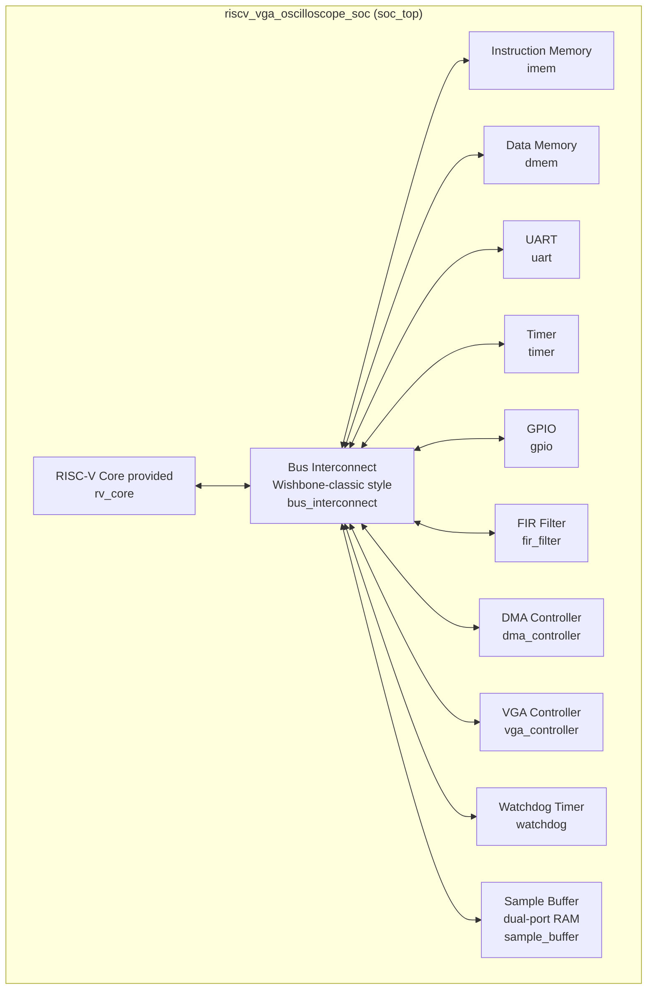
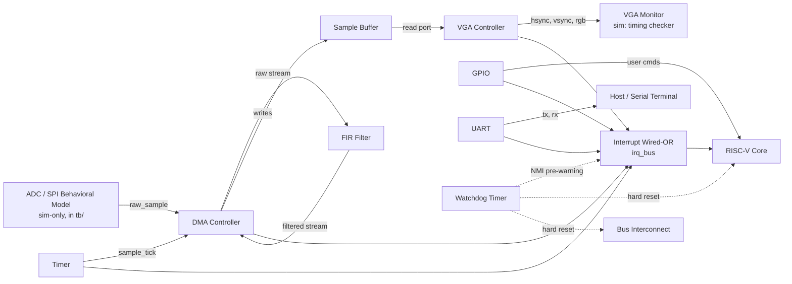
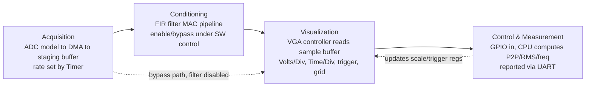

# Architecture Document
## RISC-V Real-Time Signal Acquisition, FIR Filtering, and VGA Oscilloscope SoC

**Status:** Draft v1.0
**Scope:** RTL design + simulation-based verification (no physical board bring-up required)
**Audience:** RTL/verification engineers and AI coding agents (e.g. Kiro CLI, Antigravity CLI) implementing this SoC from spec

---

## 1. Introduction

This document specifies the architecture of a System-on-Chip (SoC) built around a **provided RISC-V RTL processor core**. The SoC acquires a sampled analog-style signal (via a behavioral SPI/ADC model in simulation), conditions it through a hardware FIR filter, and renders it as a real-time, scaled waveform trace on a VGA output — functioning as an oscilloscope-style display peripheral. The processor is kept off the continuous data path: it only configures and sequences the system through memory-mapped registers, while dedicated hardware (DMA, FIR, VGA controller) moves and transforms every sample.

The application running on the RISC-V core (described fully in **Section 9**) initializes all peripherals, sets the acquisition rate, enables/bypasses filtering, configures the oscilloscope's Volts/Division, Time/Division, offset and trigger behavior, computes signal measurements (peak-to-peak, RMS, estimated frequency), and reports them over UART.

This document is the implementation contract for RTL and testbench generation. Every block, register, signal, and error/interrupt condition defined here **must** be implemented exactly as specified so that block-level and top-level testbenches can be written against a stable interface.

---

## 2. Block Diagram

### 2.1 Top-level SoC block diagram

The top-level block diagram is split into two views — bus/memory-map fabric, and cross-IP data/interrupt wiring — since drawing all ~16 blocks and ~25 connections on one diagram renders too large/cluttered in most Markdown viewers. Together the two views are equivalent to a single top-level diagram.

> **Viewing note:** the Mermaid code fences below render automatically on GitHub, GitLab, and in editors with Mermaid support (e.g. VS Code with the Mermaid extension). Standalone copies of every diagram in this document also live in `doc/diagrams/*.mermaid` for tools that render `.mermaid` files directly.

#### 2.1.1 Bus & memory-map fabric

Every block below hangs off the shared memory-mapped bus; this view shows *that* connectivity only (see §2.1.2 for the cross-IP wiring that moves sample data and interrupts directly between peripherals — some of which still terminates at the CPU or bus, e.g. interrupt delivery and the watchdog's reset, since those signals fundamentally have to reach the core and fabric to have effect).



CPU-to-bus traffic covers both instruction fetch (from `imem`) and load/store (to every other bus-mapped region); both use the same bus fabric, just different address ranges (see §8.1).

#### 2.1.2 Cross-IP data, control & interrupt connections

This view shows the connections that move sample data directly between peripherals without going through the bus fabric's register interface (ADC → DMA → FIR → sample buffer → VGA), plus the wired-OR interrupt tree and the watchdog's reset line. Note that interrupts and the watchdog reset *do* terminate at the CPU and bus (`IRQC --> CPU`, `WDT -. hard reset .-> CPU`, `WDT -. hard reset .-> BUS`) — that's unavoidable, since an interrupt or reset has to reach the core/fabric to have any effect. What this view is *not* showing is CPU/bus involvement in moving sample data — that's the point of §4/§5: the sample stream never touches a bus transaction or CPU register access on its way from ADC to display.



### 2.2 Data-flow pipeline (functional view)



### 2.3 Clock & reset domains

| Domain | Source | Used by |
|---|---|---|
| `clk_sys` | Single system clock (simulation: free-running testbench clock generator) | CPU, bus, IMEM/DMEM, UART, Timer, GPIO, FIR, DMA, Watchdog |
| `clk_vga` | Pixel clock, derived (in simulation: separate generated clock; on real hardware would come from a PLL) | VGA controller pixel/timing generator only |
| `rst_n` | Active-low, synchronous de-assertion, asserted by: power-on reset (tb-driven) OR Watchdog Timer fatal timeout | All blocks |

Cross-domain sample-buffer access (system clock domain write side, pixel clock domain read side) **must** go through the dual-clock/dual-port sample buffer's built-in synchronization (see `lib/cdc_sync.sv`, `lib/sync_fifo.sv`) — no raw signal is allowed to cross `clk_sys` <-> `clk_vga` without a synchronizer.

---

## 3. Signal List

Signals are grouped as **Boundary** (SoC top-level pins), **Internal** (bus fabric / core-to-peripheral), and **Cross-IP** (peripheral-to-peripheral, bypassing the CPU).

### 3.1 Boundary signals (`soc_top` ports)

| Signal | Dir | Width | Description |
|---|---|---|---|
| `clk_sys` | in | 1 | System clock |
| `clk_vga` | in | 1 | VGA pixel clock |
| `rst_n` | in | 1 | Async-assert / sync-deassert active-low reset |
| `adc_spi_sck` | out | 1 | SPI clock to ADC model |
| `adc_spi_mosi` | out | 1 | SPI command/config to ADC model |
| `adc_spi_miso` | in | 1 | SPI sample data from ADC model |
| `adc_spi_cs_n` | out | 1 | SPI chip-select to ADC model |
| `uart_tx` | out | 1 | UART transmit line |
| `uart_rx` | in | 1 | UART receive line |
| `gpio_in` | in | 8 | User input (buttons/switches: scale up/down, trigger level up/down, freeze/hold, reset-stats) |
| `gpio_out` | out | 8 | Status LEDs (acquiring, filter-on, triggered, error) |
| `vga_hsync` | out | 1 | Horizontal sync |
| `vga_vsync` | out | 1 | Vertical sync |
| `vga_red` | out | 4 | Red channel |
| `vga_green` | out | 4 | Green channel |
| `vga_blue` | out | 4 | Blue channel |
| `wdt_reset_out` | out | 1 | Watchdog-driven system reset indicator (observability only; internally OR'd into `rst_n` generation) |

### 3.2 Internal signals — bus fabric (`bus_interconnect`)

| Signal | Width | Description |
|---|---|---|
| `cpu_addr` | 32 | Address driven by CPU load/store or fetch unit |
| `cpu_wdata` | 32 | Write data from CPU |
| `cpu_rdata` | 32 | Read data returned to CPU |
| `cpu_we` | 1 | Write enable |
| `cpu_be` | 4 | Byte enables |
| `cpu_stb` | 1 | Strobe (valid bus request) |
| `cpu_ack` | 1 | Peripheral/memory acknowledges completion |
| `cpu_err` | 1 | Bus error (decode to unmapped address, see §6) |
| `periph_sel[7:0]` | 8 | One-hot chip-select decode: `{WDT, VGA, DMA, FIR, GPIO, TIMER, UART, reserved}` |
| `periph_addr` | 32 | Registered address fanned out to all peripherals |
| `periph_wdata` | 32 | Fanned-out write data |
| `periph_rdata[7:0]` | 32 each | Per-peripheral read data, muxed back on `periph_sel` |
| `periph_ack[7:0]` | 8 | Per-peripheral ack, muxed back to `cpu_ack` |

### 3.3 Per-IP internal signals

**UART (`uart`)**
| Signal | Dir (rel. to block) | Description |
|---|---|---|
| `tx_fifo_wdata[7:0]` | in | Byte to transmit (from `UART_TXDATA` register write) |
| `tx_fifo_full` | out | Feeds `UART_STATUS.TX_FULL` |
| `rx_fifo_rdata[7:0]` | out | Byte received (to `UART_RXDATA` register read) |
| `rx_fifo_empty` | out | Feeds `UART_STATUS.RX_EMPTY` |
| `baud_tick` | internal | Internal baud-rate generator tick |
| `irq_uart` | out | Interrupt line (RX-ready OR TX-empty OR overflow) |

**Timer (`timer`)**
| Signal | Dir | Description |
|---|---|---|
| `sample_tick` | out (cross-IP) | Pulses at the configured acquisition rate; consumed by `dma_controller` |
| `irq_timer` | out | Interrupt on compare-match / overflow |

**GPIO (`gpio`)**
| Signal | Dir | Description |
|---|---|---|
| `gpio_in_sync[7:0]` | internal | Double-flopped synchronized input |
| `gpio_change` | internal | Edge-detect on any synchronized input bit |
| `irq_gpio` | out | Interrupt on input change |

**FIR Filter (`fir_filter`)**
| Signal | Dir (cross-IP) | Description |
|---|---|---|
| `fir_sample_in[15:0]` | in, from `dma_controller` | Raw sample entering the MAC pipeline |
| `fir_sample_valid_in` | in | Qualifies `fir_sample_in` |
| `fir_sample_out[15:0]` | out, to `dma_controller` | Filtered sample |
| `fir_sample_valid_out` | out | Qualifies `fir_sample_out` |
| `fir_bypass` | internal (from `FIR_CTRL.BYPASS`) | When 1, `fir_sample_out = fir_sample_in` registered by one cycle |
| `irq_fir` | out | Interrupt on coefficient-load-done / pipeline overflow |

**DMA Controller (`dma_controller`)**
| Signal | Dir | Description |
|---|---|---|
| `dma_src_sel` | internal | 0 = ADC model, 1 = replay from `dmem` (test mode) |
| `dma_to_fir_valid/data` | cross-IP | See FIR signals above |
| `dma_from_fir_valid/data` | cross-IP | See FIR signals above |
| `sbuf_waddr[11:0]`, `sbuf_wdata[15:0]`, `sbuf_we` | cross-IP, to `sample_buffer` | Write port into sample buffer |
| `irq_dma_done` | out | Interrupt on transfer/frame complete |
| `irq_dma_err` | out | Interrupt on overflow/timeout (non-fatal, see §6/§7) |

**VGA Controller (`vga_controller`)**
| Signal | Dir | Description |
|---|---|---|
| `sbuf_raddr[11:0]`, `sbuf_rdata[15:0]` | cross-IP, from `sample_buffer` | Read port into sample buffer |
| `pixel_x[9:0]`, `pixel_y[9:0]` | internal | Current scan position (pixel clock domain) |
| `trig_level_sync[15:0]` | internal | CDC-synchronized copy of `VGA_TRIG_LEVEL` |
| `triggered` | internal | Trigger-found flag, drives free-run fallback (see §6) |
| `irq_vga_frame` | out | Interrupt on frame-complete / trigger-event |

**Watchdog Timer (`watchdog`)**
| Signal | Dir | Description |
|---|---|---|
| `kick` | in, bus-write-driven | Any write to `WDT_KICK` reloads the countdown |
| `pipeline_alive[3:0]` | cross-IP, from Timer/DMA/FIR/VGA "heartbeat" taps | Per-stage liveness bits watchdog also monitors independently of software kicks |
| `nmi_prewarn` | out | Interrupt (NMI-class) asserted one countdown-tick before fatal reset |
| `wdt_reset` | out (cross-IP, to reset generation logic) | Fatal hard reset pulse |

---

## 4. Control Paths

A **control path** configures registers to prepare hardware for an action; it is fully configured and executed **within the SoC**, i.e. it starts at a CPU register write and ends at a hardware state change or actuation — it never depends on anything outside `soc_top` other than the behavioral ADC model used purely as a stimulus source in simulation.

| # | Control Path | Start | Pre-required configuration | End |
|---|---|---|---|---|
| CP1 | **Acquisition start** | CPU writes `TIMER_CTRL.EN=1` | `TIMER_RELOAD` must already hold the desired sample-rate divisor | `timer` begins counting; on compare-match asserts `sample_tick`, which `dma_controller` samples to start pulling data from the ADC model |
| CP2 | **Filter enable/bypass** | CPU writes `FIR_CTRL.EN` and `FIR_CTRL.BYPASS` | FIR coefficient registers (`FIR_COEF0..N`) must be pre-loaded; `FIR_CTRL.COEF_LOAD_DONE` (status) must read 1 | `dma_controller` routes the raw sample stream through (`BYPASS=0`) or around (`BYPASS=1`) the FIR pipeline before writing `sample_buffer` |
| CP3 | **Display scale configure** | CPU writes `VGA_VDIV`, `VGA_TDIV`, `VGA_OFFSET` | None (defaults are safe power-on values) | `vga_controller` latches new values at the next `vsync` boundary and re-maps sample values to screen coordinates |
| CP4 | **Trigger configure** | CPU writes `VGA_TRIG_LEVEL`, `VGA_TRIG_EDGE` | Filter/acquisition must already be running (CP1) for a trigger to ever be found | `vga_controller`'s trigger comparator starts qualifying incoming samples against the new threshold/edge |
| CP5 | **Freeze / hold** | CPU (in response to `gpio_in` freeze button, via ISR) writes `VGA_CTRL.HOLD=1` | None | `vga_controller` stops advancing `sbuf_raddr`, freezing the displayed trace; `HOLD=0` resumes |
| CP6 | **DMA transfer arm** | CPU writes `DMA_CTRL.START=1` after setting `DMA_SRC_ADDR`, `DMA_DST_ADDR`, `DMA_LEN` | Source/destination pointers must be within valid memory-mapped ranges (else `DMA_STATUS.ERR` — see §6) | `dma_controller` FSM moves from `IDLE` to `RUNNING`, asserting `irq_dma_done` on completion |
| CP7 | **Watchdog arm/kick** | CPU writes `WDT_CTRL.EN=1`, then periodically writes `WDT_KICK` | `WDT_RELOAD` must hold desired timeout value | `watchdog` counts down; each `WDT_KICK` write reloads the counter, preventing `nmi_prewarn`/`wdt_reset` |

---

## 5. Data Paths

A **data path** is the route that sample/measurement *payload* takes, as distinct from control-register traffic (§4). Every data path below is memory-mapped and DMA- or hardware-driven; the CPU never touches per-sample data on the hot path.

| # | Data Path | Route | Notes |
|---|---|---|---|
| DP1 | **Raw acquisition** | `adc_model` → `dma_controller` (SPI read) → staging region of `dmem` | Always active whenever CP1 is armed |
| DP2 | **Filtered stream** | `dmem` (raw staging) → `dma_controller` → `fir_filter` → `dma_controller` → `sample_buffer` | Active when `FIR_CTRL.BYPASS=0` |
| DP3 | **Bypass stream** | `dmem` (raw staging) → `dma_controller` → `sample_buffer` (FIR skipped) | Active when `FIR_CTRL.BYPASS=1`; lets firmware A/B compare raw vs. filtered by toggling CP2 |
| DP4 | **Display read** | `sample_buffer` → `vga_controller` read port → pixel comparator/grid generator → `{vga_hsync, vga_vsync, vga_red, vga_green, vga_blue}` | Read-only, pixel-clock domain |
| DP5 | **Measurement read-back** | `sample_buffer` → CPU (bus read, software loop) → computed P2P/RMS/frequency (see §9) → `UART_TXDATA` → `uart_tx` | The only data path the CPU actively participates in, by design (measurement math needs the core; everything upstream is hardware) |
| DP6 | **Register control/status traffic** | CPU ↔ `periph_addr/wdata/rdata` (bus) | Explicitly **not** a data path in the sample-traffic sense — see register classification below |

**Register classification rule (control vs. data):**
- **Control registers** (`*_CTRL`, `*_CFG`, e.g. `TIMER_CTRL`, `FIR_CTRL`, `VGA_VDIV`) — configure *how* a hardware path behaves; writing them never itself moves sample payload.
- **Data registers** (`UART_TXDATA`, `UART_RXDATA`, and the `sample_buffer` memory-mapped window) — carry payload bytes/samples; every write/read of these *is* traffic on a data path (DP5, DP1–DP4 respectively via DMA, not CPU).
- **Status registers** (`*_STATUS`) — read-only reflections of state; reading them never disturbs a data path.

This classification is authoritative and used verbatim in the Register Description (§8) `Class` column.

---

## 6. Error Cases

Per project policy: **only the error conditions explicitly enumerated below are non-fatal**, each with its own defined recovery path executed entirely within the environment (firmware + hardware). **Any other, unenumerated error condition is fatal by definition**, and the *only* recovery path for a fatal error is a **watchdog-driven reset or full power-off/power-on cycle** — there is no software-only recovery for fatal errors.

### 6.1 Non-fatal errors (defined, with recovery)

| Error | Detecting block | Indicated by | Recovery path |
|---|---|---|---|
| **Sample buffer overflow** (write pointer laps read pointer) | `dma_controller` | `DMA_STATUS.OVF` (W1C) + `irq_dma_err` | ISR reads `DMA_STATUS`, writes 1 to `OVF` to clear, resumes DMA from current pointer (newest samples kept, oldest dropped) |
| **UART TX FIFO overflow** (write while full) | `uart` | `UART_STATUS.TX_OVF` (W1C) + `irq_uart` | ISR/firmware clears `TX_OVF`; dropped byte is simply retransmitted by the measurement-report routine on its next cycle |
| **ADC sample underrun** (Timer ticks but no new SPI sample ready) | `dma_controller` | `DMA_STATUS.UNDERRUN` (W1C) + `irq_dma_err` | Firmware clears flag; hardware repeats the last valid sample for one tick (documented, not silently wrong) |
| **DMA transfer timeout** (armed transfer does not complete within `DMA_TIMEOUT` cycles) | `dma_controller` | `DMA_STATUS.TIMEOUT` (W1C) + `irq_dma_err` | ISR writes `DMA_CTRL.ABORT=1` to force FSM to `IDLE`, then re-issues CP6 |
| **Bus access to unmapped/reserved address** | `bus_interconnect` | `cpu_err` pulse (no peripheral side-effect); logged in `BUS_STATUS.LAST_ERR_ADDR` | CPU trap handler logs the faulting address via UART and returns to the instruction after the faulting access (no hardware state changed, so it is always safe to continue) |
| **VGA trigger not found within holdoff window** (`VGA_TRIG_HOLDOFF` frames elapse with no qualifying edge) | `vga_controller` | `VGA_STATUS.NOTRIG` (W1C) + `irq_vga_frame` | `vga_controller` automatically falls back to free-run (untriggered) display; firmware clears `NOTRIG` and may re-arm CP4 with a different level/edge |

### 6.2 Fatal errors (undefined/unenumerated → reset/power-off only)

Any condition not listed in §6.1 is fatal, including but not limited to:
- Bus protocol violation (a peripheral asserts `ack` without a preceding `stb`, or never returns `ack` at all — this is exactly what the Watchdog's `pipeline_alive` taps exist to catch)
- Memory corruption/parity mismatch beyond what any implemented protection can correct
- Any peripheral FSM reaching an `X`/illegal state
- Watchdog full timeout (i.e. `nmi_prewarn` was asserted and no `WDT_KICK` followed before the final countdown expired)

**Recovery for fatal errors:** the `watchdog` module asserts `wdt_reset`, which is OR'd into system `rst_n` generation, forcing a full synchronous reset of every block. In simulation, the testbench treats an unexpected `wdt_reset` pulse as a test failure unless the test explicitly injects a fatal condition to verify this path. There is no in-band software recovery — this is intentional per the project's error-handling policy.

---

## 7. All Possible Interrupts

**Errors are a subset of interrupts**: every non-fatal error in §6.1 raises an interrupt line; not every interrupt is an error (e.g. "transfer complete" is a normal-operation interrupt, not an error).

| IRQ # | Name | Source | Class | Recovery path when it fires |
|---|---|---|---|---|
| 0 | `irq_timer` | `timer` | Normal | ISR notes tick for firmware-side timekeeping if needed; no recovery action required |
| 1 | `irq_dma_done` | `dma_controller` | Normal | ISR marks buffer ready for measurement (DP5); no recovery action required |
| 2 | `irq_dma_err` | `dma_controller` | **Error (non-fatal)** | See §6.1 rows: overflow / underrun / timeout — ISR reads `DMA_STATUS` to disambiguate which sub-flag fired, clears it (W1C), takes the matching recovery action |
| 3 | `irq_uart` | `uart` | Mixed (RX-ready = normal; `TX_OVF` = **error, non-fatal**) | RX-ready: ISR drains `UART_RXDATA`. TX_OVF: see §6.1 |
| 4 | `irq_gpio` | `gpio` | Normal | ISR reads `GPIO_IN`, dispatches to the matching control path (CP3–CP5) based on which button changed |
| 5 | `irq_vga_frame` | `vga_controller` | Mixed (frame-complete = normal; `NOTRIG` = **error, non-fatal**) | Frame-complete: no action, or firmware may piggyback measurement refresh here. `NOTRIG`: see §6.1 |
| 6 | `irq_fir` | `fir_filter` | Normal | Coefficient-load-done: firmware may proceed to CP2. Pipeline overflow is treated as **fatal** (unenumerated in §6.1) since it indicates a MAC pipeline design/timing fault, not an expected runtime condition |
| 7 | `nmi_prewarn` (Watchdog) | `watchdog` | **Fatal pre-warning (NMI class)** | Highest-priority, non-maskable. ISR has one countdown-tick to attempt a best-effort UART log of system state and issue `WDT_KICK`. If `WDT_KICK` is not issued before the counter expires, `wdt_reset` fires and full reset recovery (§6.2) is the only path — the NMI ISR **cannot** itself prevent the fatal path other than by kicking in time |

Interrupts 0–6 are maskable via `IRQ_MASK` (a CPU-local or bus-mapped register, implementation detail left to the RISC-V core's provided interrupt controller convention); IRQ 7 (`nmi_prewarn`) is **never maskable**, by design, since its entire purpose is to guarantee the fatal-path recovery contract in §6.2 always holds.

---

## 8. Register Description

All peripheral registers are 32-bit, word-aligned, accessed via the bus at the base addresses in §8.1. Bit fields not listed are reserved (read as 0, writes ignored). `Class` follows the §5 classification rule: **C**=Control, **S**=Status, **D**=Data.

### 8.1 Memory Map

| Region | Base Address | Size | Notes |
|---|---|---|---|
| Instruction Memory (`imem`) | `0x0000_0000` | 64 KB | Program storage |
| Data Memory (`dmem`) | `0x0001_0000` | 64 KB | Includes raw-sample staging region at offset `0x0000` |
| Sample Buffer (`sample_buffer`) | `0x0002_0000` | 8 KB (4096 x 16-bit samples) | DMA write port / VGA read port; also CPU-readable for DP5 |
| UART | `0x8000_0000` | 4 KB | |
| Timer | `0x8000_1000` | 4 KB | |
| GPIO | `0x8000_2000` | 4 KB | |
| FIR Filter | `0x8000_3000` | 4 KB | |
| DMA Controller | `0x8000_4000` | 4 KB | |
| VGA Controller | `0x8000_5000` | 4 KB | |
| Watchdog Timer | `0x8000_6000` | 4 KB | |

### 8.2 UART (base `0x8000_0000`)

| Offset | Name | Class | Access | Reset | Bits | Description |
|---|---|---|---|---|---|---|
| `0x00` | `UART_CTRL` | C | RW | `0x0000_0001` | `[0] EN`, `[3:1] BAUD_SEL` | Enable UART; select baud divisor preset |
| `0x04` | `UART_STATUS` | S | RO / W1C | `0x0000_0002` | `[0] RX_READY`, `[1] TX_EMPTY`, `[2] TX_FULL`, `[3] TX_OVF (W1C)` | Live status + non-fatal error flag |
| `0x08` | `UART_TXDATA` | D | WO | `0x0000_0000` | `[7:0] DATA` | Byte to transmit (push into TX FIFO) |
| `0x0C` | `UART_RXDATA` | D | RO | `0x0000_0000` | `[7:0] DATA` | Byte received (pop from RX FIFO) |
| `0x10` | `UART_IRQ_EN` | C | RW | `0x0000_0000` | `[0] RX_READY_EN`, `[1] TX_OVF_EN` | Per-source interrupt enables for `irq_uart` |

### 8.3 Timer (base `0x8000_1000`)

| Offset | Name | Class | Access | Reset | Bits | Description |
|---|---|---|---|---|---|---|
| `0x00` | `TIMER_CTRL` | C | RW | `0x0000_0000` | `[0] EN` | Start/stop the counter |
| `0x04` | `TIMER_RELOAD` | C | RW | `0x0000_0000` | `[31:0] RELOAD` | Compare value that sets the acquisition sample rate |
| `0x08` | `TIMER_COUNT` | S | RO | `0x0000_0000` | `[31:0] COUNT` | Current counter value (debug/verification only) |
| `0x0C` | `TIMER_STATUS` | S | RO / W1C | `0x0000_0000` | `[0] TICK (W1C)` | Set on each compare-match (also drives `sample_tick`) |

### 8.4 GPIO (base `0x8000_2000`)

| Offset | Name | Class | Access | Reset | Bits | Description |
|---|---|---|---|---|---|---|
| `0x00` | `GPIO_IN` | S | RO | — | `[7:0] IN` | Synchronized input value |
| `0x04` | `GPIO_OUT` | C | RW | `0x0000_0000` | `[7:0] OUT` | Drives `gpio_out` (status LEDs) |
| `0x08` | `GPIO_IRQ_EN` | C | RW | `0x0000_0000` | `[7:0] CHANGE_EN` | Per-bit change-interrupt enable |
| `0x0C` | `GPIO_STATUS` | S | RO / W1C | `0x0000_0000` | `[0] CHANGED (W1C)` | Any enabled bit changed since last clear |

### 8.5 FIR Filter (base `0x8000_3000`)

| Offset | Name | Class | Access | Reset | Bits | Description |
|---|---|---|---|---|---|---|
| `0x00` | `FIR_CTRL` | C | RW | `0x0000_0002` | `[0] EN`, `[1] BYPASS` | Enable filter pipeline; bypass routes raw samples straight through (CP2) |
| `0x04` | `FIR_NTAPS` | C | RW | `0x0000_0008` | `[5:0] NTAPS` | Active tap count (≤ implemented max, e.g. 16) |
| `0x08`–`0x44` | `FIR_COEF0`…`FIR_COEF15` | C | RW | `0x0000_0000` | `[15:0] COEF` (signed Q1.15) | Coefficient set, one register per tap |
| `0x48` | `FIR_STATUS` | S | RO / W1C | `0x0000_0000` | `[0] COEF_LOAD_DONE`, `[1] PIPE_OVF (W1C, fatal-class per §6.2)` | |

### 8.6 DMA Controller (base `0x8000_4000`)

| Offset | Name | Class | Access | Reset | Bits | Description |
|---|---|---|---|---|---|---|
| `0x00` | `DMA_CTRL` | C | RW | `0x0000_0000` | `[0] START`, `[1] ABORT` | Arm transfer (CP6) / force-abort (error recovery) |
| `0x04` | `DMA_SRC_ADDR` | C | RW | `0x0000_0000` | `[31:0] ADDR` | Source pointer |
| `0x08` | `DMA_DST_ADDR` | C | RW | `0x0000_0000` | `[31:0] ADDR` | Destination pointer |
| `0x0C` | `DMA_LEN` | C | RW | `0x0000_0000` | `[15:0] LEN` | Transfer length in samples |
| `0x10` | `DMA_TIMEOUT` | C | RW | `0x0000_FFFF` | `[31:0] CYCLES` | Cycle budget before `TIMEOUT` error |
| `0x14` | `DMA_STATUS` | S | RO / W1C | `0x0000_0000` | `[0] BUSY`, `[1] DONE (W1C)`, `[2] OVF (W1C)`, `[3] UNDERRUN (W1C)`, `[4] TIMEOUT (W1C)`, `[5] ERR (W1C)` | |

### 8.7 VGA Controller (base `0x8000_5000`)

| Offset | Name | Class | Access | Reset | Bits | Description |
|---|---|---|---|---|---|---|
| `0x00` | `VGA_CTRL` | C | RW | `0x0000_0000` | `[0] EN`, `[1] HOLD`, `[2] GRID_EN` | Enable display / freeze (CP5) / reference-grid overlay |
| `0x04` | `VGA_VDIV` | C | RW | `0x0000_0040` | `[15:0] VDIV` | Volts/Division scale factor (fixed-point) |
| `0x08` | `VGA_TDIV` | C | RW | `0x0000_0020` | `[15:0] TDIV` | Time/Division scale factor |
| `0x0C` | `VGA_OFFSET` | C | RW | `0x0000_0000` | `[15:0] OFFSET` (signed) | Vertical trace offset |
| `0x10` | `VGA_TRIG_LEVEL` | C | RW | `0x0000_0000` | `[15:0] LEVEL` (signed) | Trigger comparator threshold (CP4) |
| `0x14` | `VGA_TRIG_EDGE` | C | RW | `0x0000_0000` | `[0] EDGE (0=rising,1=falling)` | |
| `0x18` | `VGA_TRIG_HOLDOFF` | C | RW | `0x0000_0010` | `[15:0] FRAMES` | Frames to wait before declaring `NOTRIG` |
| `0x1C` | `VGA_STATUS` | S | RO / W1C | `0x0000_0000` | `[0] FRAME_DONE (W1C)`, `[1] TRIGGERED`, `[2] NOTRIG (W1C)` | |

### 8.8 Watchdog Timer (base `0x8000_6000`)

| Offset | Name | Class | Access | Reset | Bits | Description |
|---|---|---|---|---|---|---|
| `0x00` | `WDT_CTRL` | C | RW | `0x0000_0000` | `[0] EN` | Arm the watchdog (CP7) |
| `0x04` | `WDT_RELOAD` | C | RW | `0xFFFF_FFFF` | `[31:0] RELOAD` | Countdown reload/timeout value |
| `0x08` | `WDT_KICK` | C | WO (any write) | — | — | Write-any-value reloads the countdown |
| `0x0C` | `WDT_STATUS` | S | RO | `0x0000_0000` | `[0] PREWARN`, `[1] TRIPPED` | `TRIPPED` only ever observable post-mortem via a debug scan chain in simulation, since `wdt_reset` clears live state |

---

## 9. Application

The firmware application running on the RISC-V core is the "acquire → filter → display → measure → report" control program. It is the only place software logic lives; every per-sample and per-pixel operation happens in hardware (§4/§5).

### 9.1 Boot & initialization sequence

1. Reset vector begins execution from `imem`; stack pointer initialized.
2. Mask all interrupts except `nmi_prewarn` (which is always unmaskable) while configuring peripherals, to avoid handling spurious IRQs mid-setup.
3. Program `TIMER_RELOAD` for the default acquisition rate (e.g. a rate compatible with the simulated signal frequency range).
4. Load default FIR coefficients (`FIR_COEF0..N`) for a chosen response (e.g. a simple moving-average or low-pass set) and set `FIR_NTAPS`; poll `FIR_STATUS.COEF_LOAD_DONE`.
5. Program default `VGA_VDIV`, `VGA_TDIV`, `VGA_OFFSET`, `VGA_TRIG_LEVEL`, `VGA_TRIG_EDGE`, `VGA_TRIG_HOLDOFF`; set `VGA_CTRL.EN=1`, `GRID_EN=1`.
6. Program `WDT_RELOAD` and set `WDT_CTRL.EN=1` (CP7) — the watchdog is armed early so any subsequent hang during bring-up is itself caught.
7. Unmask all interrupts (`IRQ_MASK`), then set `TIMER_CTRL.EN=1` (CP1) to start acquisition.
8. Enter the main loop.

### 9.2 Main loop (interrupt-driven, not polling the hot path)

The main loop itself is intentionally simple: it `WFI`-waits (or busy-idles, per the provided core's convention) for interrupts and periodically services the measurement/report path. All real-time work is done in ISRs or in hardware; the loop only does the non-real-time measurement math on DP5.

```
loop:
  wait_for_interrupt()
  if irq_dma_done pending:
    clear irq_dma_done
    run_measurement_pass()   # see 9.3, reads sample_buffer via DP5
  if irq_gpio pending:
    clear irq_gpio
    dispatch_gpio_command()  # see 9.4, drives CP3/CP4/CP5
  if irq_dma_err / irq_uart(TX_OVF) / irq_vga_frame(NOTRIG) pending:
    run_non_fatal_recovery() # see 6.1, per-flag handling
  goto loop
```

`WDT_KICK` is written once per loop iteration (or once per successfully-completed measurement pass, whichever is the stricter liveness proof) so that a genuine software hang is indistinguishable from — and caught by — the same fatal path as a hardware stall (§6.2), which is the intended behavior per the project's robustness goal.

### 9.3 Measurement pass (DP5)

On each `irq_dma_done` (a full sample-buffer frame has been written by hardware), firmware performs:

- **Peak-to-peak voltage:** single pass over the buffer window tracking running `min`/`max`; `P2P = max − min` (converted to volts using `VGA_VDIV` scale).
- **RMS:** accumulate `sum(sample^2)` across the window in a 32/64-bit accumulator, divide by sample count, integer square-root (Newton's method, fixed iteration count for determinism in simulation).
- **Estimated frequency:** zero-crossing counting against the mean level — count sign transitions across the window, `freq_est = (crossings / 2) × (sample_rate / window_length)`, where `sample_rate` is derived from `TIMER_RELOAD` and the known system clock frequency.
- Results are formatted (fixed-point-to-ASCII, no floating point required) and pushed byte-by-byte into `UART_TXDATA`, gated on `UART_STATUS.TX_FULL` to avoid triggering `TX_OVF` in normal operation (the `TX_OVF` non-fatal path exists purely as a safety net for burst conditions, not the expected steady state).

### 9.4 GPIO command dispatch (`gpio_in` bit assignments)

| Bit | Function | Control path exercised |
|---|---|---|
| 0 | Volts/Div up | CP3 (`VGA_VDIV` increment, clamped to a max) |
| 1 | Volts/Div down | CP3 (`VGA_VDIV` decrement, clamped to a min) |
| 2 | Time/Div up | CP3 (`VGA_TDIV` increment) |
| 3 | Time/Div down | CP3 (`VGA_TDIV` decrement) |
| 4 | Trigger level up | CP4 (`VGA_TRIG_LEVEL` increment) |
| 5 | Trigger level down | CP4 (`VGA_TRIG_LEVEL` decrement) |
| 6 | Freeze / hold toggle | CP5 (`VGA_CTRL.HOLD` toggle) |
| 7 | Toggle filter bypass | CP2 (`FIR_CTRL.BYPASS` toggle), for raw-vs-filtered comparison |

`gpio_out` bits mirror status for observability in simulation waveform review: `[0]` acquiring, `[1]` filter active (`!BYPASS`), `[2]` triggered (`VGA_STATUS.TRIGGERED`), `[3]` any non-fatal error currently asserted (OR of all W1C error flags before they're cleared).

### 9.5 Verification hooks

Because this application must be exercised entirely through RTL simulation, the `tb/` testbenches drive `adc_spi_miso` with known waveforms (DC, sine, square, chirp) and independently compute expected P2P/RMS/frequency in the testbench's reference model, comparing against what the firmware reports over `uart_tx`. This closes the loop end-to-end (acquisition → filter → display registers → measurement → UART) without requiring real hardware.

---

## Appendix A — Project Directory Structure

This repository is organized so it can be `git init`'d and pushed as-is. The layout below mirrors the required structure:

```
riscv-vga-oscilloscope-soc/
├── README.md                # Project overview, build/run instructions
├── LICENSE
├── .gitignore                # Simulator/build artifacts (see below)
├── Makefile                  # Top-level entry point (build / sim / lint / clean)
├── doc/                       # All docs
│   ├── ProjectAbstract.md
│   ├── ArchitectureDocument.md   # <- this document
│   └── register_map.md          # (optional) generated/standalone copy of §8
├── scripts/                   # Build & run automation
│   ├── build.sh
│   ├── run_sim.sh
│   └── lint.sh
├── rtl/                        # Design files (synthesizable RTL)
│   ├── soc_top.sv
│   ├── bus_interconnect.sv
│   ├── imem.sv
│   ├── dmem.sv
│   ├── sample_buffer.sv
│   ├── uart.sv
│   ├── timer.sv
│   ├── gpio.sv
│   ├── fir_filter.sv
│   ├── dma_controller.sv
│   ├── vga_controller.sv
│   └── watchdog.sv
├── tb/                          # Testbench files
│   ├── tb_soc_top.sv
│   ├── adc_model.sv             # behavioral SPI/ADC stimulus model
│   ├── tb_uart.sv
│   ├── tb_fir_filter.sv
│   ├── tb_dma_controller.sv
│   └── tb_vga_controller.sv
├── lib/                          # Reusable library files
│   ├── sync_fifo.sv
│   ├── cdc_sync.sv
│   └── mux_demux.sv
├── reg/                          # Register definition/generation files
│   ├── soc_regmap.json          # machine-readable register map (source of truth)
│   └── soc_regmap.h              # generated C header for firmware
└── run/                          # Simulation run outputs (gitignored except .gitkeep)
    └── .gitkeep
```

**Notes for whoever (or whichever agent) implements this:**
- Treat `reg/soc_regmap.json` as the single source of truth for §8; `soc_regmap.h` and `doc/register_map.md` should be regenerated from it, not hand-edited independently, to avoid drift.
- `run/` holds simulator-generated waveforms (`*.vcd`, `*.wlf`), logs, and coverage databases — these are build artifacts and must not be committed (see `.gitignore`).
- Every RTL file in `rtl/` should have a same-named counterpart test in `tb/` (e.g. `fir_filter.sv` ↔ `tb_fir_filter.sv`) plus coverage in `tb_soc_top.sv` for the cross-IP control/data paths in §4/§5.
- Interrupt, error, and register naming used in RTL/firmware **must** match §7/§8 exactly (signal and field names) so that generated register headers and testbenches stay consistent with this document.
