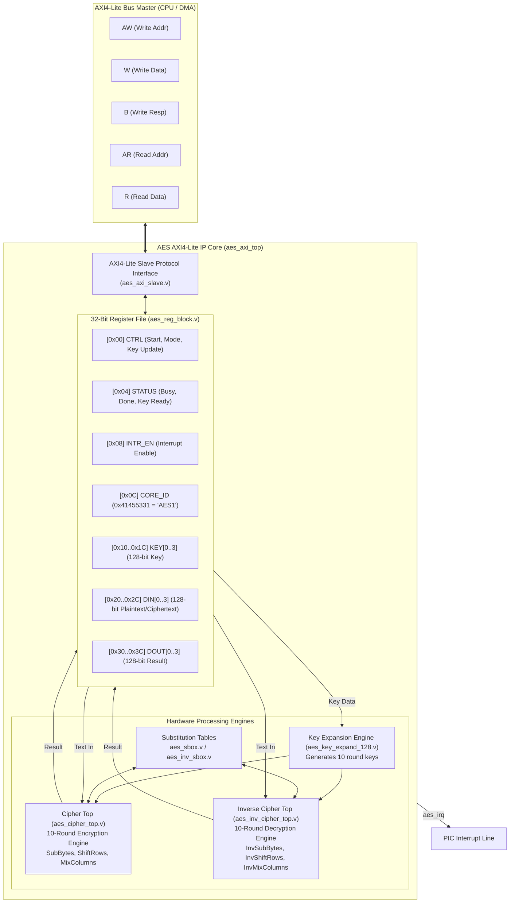

# AES-128 Cryptographic Accelerator IP Core

[](#architecture-overview)
[](#register-memory-map)
[
[](aes_core.core)

> **Navigation:** [Root README](../../README.md) &nbsp;|&nbsp; [RTL Overview](../README.md) &nbsp;|&nbsp; [VeeR EL2 Core](../veer_el2/README.md) &nbsp;|&nbsp; [AXI Interconnect](../interconnect/README.md) &nbsp;|&nbsp; [AXI UART](../axi_uart/README.md)

---

## 1. Overview

> [!NOTE]
> **Experimental / Educational Purpose:**
> This AES Core is **not a required component** of the primary RISC-V Real-Time Signal Acquisition, FIR Filtering, and VGA Oscilloscope SoC pipeline. It is incorporated into the repository for **experimental and educational purposes**: to study, implement, and verify how an autonomous cryptographic coprocessor attaches to an AXI interconnect crossbar, how 32-bit Control and Status Registers (CSRs) are structured and decoded, and how multi-cycle hardware handshaking operates over memory-mapped transactions.

The **AES-128 Cryptographic Accelerator** is a high-throughput, hardware-accelerated encryption and decryption engine implementing the **NIST FIPS-197 Advanced Encryption Standard**. It features an integrated **AXI4-Lite slave interface**, enabling the VeeR EL2 processor or DMA controller to offload cryptographic block operations (ECB/CBC/CTR modes) with minimal CPU overhead.

### Key Specifications

- **Cipher Standard:** 100% compliant with NIST FIPS-197 AES specifications.
- **Key & Block Size:** 128-bit symmetric key, 128-bit block size.
- **Execution Engine:** Dual dedicated pipelines for Encryption (`aes_cipher_top.v`) and Decryption (`aes_inv_cipher_top.v`).
- **Pipelined Iterative Architecture:** 10-round iterative datapath utilizing hardware S-box substitution, ShiftRows permutation, MixColumns diffusion, and on-the-fly round key expansion.
- **Bus Interface:** 32-bit AXI4-Lite Slave interface supporting single-cycle register read and write operations.
- **Interrupt Support:** Level/pulse interrupt output (`irq`) triggered upon completion of key expansion or block cipher processing.

---

## 2. Block Diagram



---

## 3. Directory Structure

The AES core files are organized in `rtl/aes_core-master/`:

```
honours_project_soc-main/rtl/aes_core-master/
├── aes_axi_filelist.f             # VCS/Verilog filelist for AXI wrapper
├── aes_axi_register_spec.txt      # Hardware interface & register specification
├── aes_core.core                  # FuseSoC core descriptor
├── aes_filelist.f                 # Standalone core filelist
├── doc/
│   └── aes.pdf                    # Detailed mathematical specification
├── bench/                         # Verification testbenches
├── data/                          # NIST test vectors and test data
├── rtl/verilog/                   # Synthesizable RTL source files
│   ├── aes_axi_slave.v            # AXI4-Lite bus state machine
│   ├── aes_axi_top.v              # Top-level AXI wrapper
│   ├── aes_cipher_top.v           # 10-round encryption pipeline
│   ├── aes_inv_cipher_top.v       # 10-round decryption pipeline
│   ├── aes_inv_sbox.v             # Inverse Galois Field S-box lookup
│   ├── aes_key_expand_128.v       # 128-bit key schedule generator
│   ├── aes_rcon.v                 # Round constant generation ROM
│   ├── aes_reg_block.v            # 32-bit Memory-mapped CSRs
│   ├── aes_sbox.v                 # Forward Galois Field S-box lookup
│   └── timescale.v                # Simulation timescale definitions
└── syn/                           # Synthesis scripts and constraints
```

---

## 4. Register Memory Map

All registers are 32-bit wide, word-aligned, and mapped starting at the AES base address (`0x0100_0000` via AXI Interconnect port `m01`):

| Offset | Register | Access | Reset | Description |
|---|---|---|---|---|
| **`0x00`** | **`CTRL`** | RW | `0x0000_0000` | Control register: `[0]` START, `[1]` MODE, `[2]` KEY_UPDATE, `[3]` SOFT_RESET |
| **`0x04`** | **`STATUS`** | RO | `0x0000_0000` | Status register: `[0]` BUSY, `[1]` DONE, `[2]` KEY_READY |
| **`0x08`** | **`INTR_EN`** | RW | `0x0000_0000` | Interrupt enable mask: `[0]` DONE_IRQ_EN |
| **`0x0C`** | **`CORE_ID`** | RO | `0x4145_5331` | Core identification word (`ASCII "AES1"`) |
| **`0x10`** | **`KEY0`** | RW | `0x0000_0000` | AES Key bits `[127:96]` (Word 0, MSW) |
| **`0x14`** | **`KEY1`** | RW | `0x0000_0000` | AES Key bits `[95:64]` (Word 1) |
| **`0x18`** | **`KEY2`** | RW | `0x0000_0000` | AES Key bits `[63:32]` (Word 2) |
| **`0x1C`** | **`KEY3`** | RW | `0x0000_0000` | AES Key bits `[31:0]` (Word 3, LSW) |
| **`0x20`** | **`DIN0`** | RW | `0x0000_0000` | Data Input bits `[127:96]` (Word 0, MSW) |
| **`0x24`** | **`DIN1`** | RW | `0x0000_0000` | Data Input bits `[95:64]` (Word 1) |
| **`0x28`** | **`DIN2`** | RW | `0x0000_0000` | Data Input bits `[63:32]` (Word 2) |
| **`0x2C`** | **`DIN3`** | RW | `0x0000_0000` | Data Input bits `[31:0]` (Word 3, LSW) |
| **`0x30`** | **`DOUT0`** | RO | `0x0000_0000` | Data Output bits `[127:96]` (Word 0, MSW) |
| **`0x34`** | **`DOUT1`** | RO | `0x0000_0000` | Data Output bits `[95:64]` (Word 1) |
| **`0x38`** | **`DOUT2`** | RO | `0x0000_0000` | Data Output bits `[63:32]` (Word 2) |
| **`0x3C`** | **`DOUT3`** | RO | `0x0000_0000` | Data Output bits `[31:0]` (Word 3, LSW) |

---

## 5. Control Register Bitfields

### Control Register (`CTRL`, Offset `0x00`)

```
 31                                       4       3         2         1        0
+------------------------------------------+-------------+---------+--------+-------+
|                 Reserved                 |  SOFT_RESET | KEY_UPD |  MODE  | START |
+------------------------------------------+-------------+---------+--------+-------+
```

- **`START` (Bit 0):** Pulse `1` to begin cipher execution on data currently loaded in `DIN0..DIN3`. Auto-clears.
- **`MODE` (Bit 1):** Operation mode selection. `0` = Encrypt, `1` = Decrypt.
- **`KEY_UPDATE` (Bit 2):** Pulse `1` to latch `KEY0..KEY3` into the key expansion engine. Auto-clears.
- **`SOFT_RESET` (Bit 3):** Resets internal cipher datapaths without disturbing AXI bus state.

### Status Register (`STATUS`, Offset `0x04`)

- **`BUSY` (Bit 0):** `1` when either the key expansion or cipher engine is active.
- **`DONE` (Bit 1):** `1` when cipher computation has finished and valid result is present in `DOUT0..DOUT3`. Cleared upon next `START`.
- **`KEY_READY` (Bit 2):** `1` when round key schedule generation is complete.

---

## 6. Software Programming Guide

### 6.1 Key Initialization Flow

```c
#define AES_BASE   0x01000000
#define AES_CTRL   (*(volatile uint32_t*)(AES_BASE + 0x00))
#define AES_STATUS (*(volatile uint32_t*)(AES_BASE + 0x04))
#define AES_KEY(i) (*(volatile uint32_t*)(AES_BASE + 0x10 + (4*(i))))

void aes_set_key(const uint32_t key[4]) {
    // 1. Write the 128-bit key words
    AES_KEY(0) = key[0];
    AES_KEY(1) = key[1];
    AES_KEY(2) = key[2];
    AES_KEY(3) = key[3];

    // 2. Trigger Key Expansion (CTRL[2] = 1)
    AES_CTRL = (1 << 2);

    // 3. Poll until Key Ready (STATUS[2] == 1)
    while (!(AES_STATUS & (1 << 2)));
}
```

### 6.2 128-bit Block Encryption Flow

```c
#define AES_DIN(i)  (*(volatile uint32_t*)(AES_BASE + 0x20 + (4*(i))))
#define AES_DOUT(i) (*(volatile uint32_t*)(AES_BASE + 0x30 + (4*(i))))

void aes_encrypt_block(const uint32_t plaintext[4], uint32_t ciphertext[4]) {
    // 1. Write 128-bit plaintext block
    AES_DIN(0) = plaintext[0];
    AES_DIN(1) = plaintext[1];
    AES_DIN(2) = plaintext[2];
    AES_DIN(3) = plaintext[3];

    // 2. Start encryption (CTRL[0]=1, MODE=0)
    AES_CTRL = (1 << 0);

    // 3. Wait for completion (STATUS[1] == 1)
    while (!(AES_STATUS & (1 << 1)));

    // 4. Read out 128-bit ciphertext block
    ciphertext[0] = AES_DOUT(0);
    ciphertext[1] = AES_DOUT(1);
    ciphertext[2] = AES_DOUT(2);
    ciphertext[3] = AES_DOUT(3);
}
```

---

## 7. Related Documentation

- [Root README](../../README.md) — Complete SoC Architecture & System Overview
- [RTL Subsystem Hub](../README.md) — Subsystem Top-Level & Integration Details
- [VeeR EL2 Core README](../veer_el2/README.md) — RISC-V Processor Core
- [AXI Interconnect README](../interconnect/README.md) — 3-Master x 10/14-Slave Bus Fabric
- [AXI UART README](../axi_uart/README.md) — AXI4-Lite UART Core

---

## 8. Third-Party IP Provenance & Attribution

- **IP Core Name**: AES Cryptographic Accelerator (`aes_core`, `aes_cipher_top`, `aes_inv_cipher_top`, `aes_key_expand_128`, `aes_sbox`)
- **Original Author**: Joachim Strömbergon (<joachim@secworks.se>)
- **Organization / Repository**: Secworks ([https://github.com/secworks/aes](https://github.com/secworks/aes))
- **License**: BSD 2-Clause License
- **Integration Scope**: Incorporated strictly for **experimental and educational purposes** to study how slave IPs attach to AXI crossbars and decode CSR registers. It is **not required** for the primary signal acquisition, filtering, and oscilloscope display pipeline.
