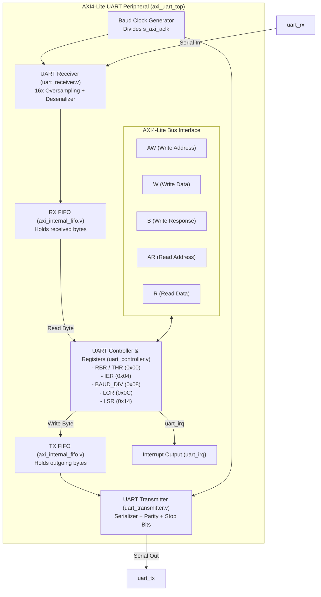

# AXI4-Lite UART IP Core

[](#interface-pins)
[](#register-map)
[
[](rtl/axi_uart_top.v)

> **Navigation:** [Root README](../../README.md) &nbsp;|&nbsp; [RTL Overview](../README.md) &nbsp;|&nbsp; [VeeR EL2 Core](../veer_el2/README.md) &nbsp;|&nbsp; [AXI Interconnect](../interconnect/README.md) &nbsp;|&nbsp; [AES Core](../aes_core-master/README.md)

---

## 1. Overview

The **AXI4-Lite UART IP Core** is a robust, full-duplex asynchronous serial communication peripheral designed for SoC integration. It interfaces seamlessly with the AXI4 Interconnect, allowing the VeeR EL2 processor core to transmit diagnostic output, log real-time measurement results (Peak-to-Peak voltage, RMS, frequency calculations), and receive host commands.

The peripheral implements a register architecture compatible with the classic National Semiconductor **16550 UART**, featuring internal FIFO buffering, programmable baud rate generation, hardware parity calculation, and multi-condition interrupt generation.

### Key Features

- **Standard AXI4-Lite Slave Interface:** 32-bit data bus and byte-level register addressing.
- **Full-Duplex Serial Communication:** Independent transmit (`uart_tx`) and receive (`uart_rx`) paths.
- **Hardware FIFO Buffering:** Internal FIFOs (`axi_internal_fifo.v`) for both TX and RX channels to prevent data overrun under high system bus traffic.
- **Programmable Baud Rate Generator:** Divisor register supports standard baud rates (9600, 19200, 38400, 57600, 115200 bps, etc.) from configurable system clocks (50 MHz / 100 MHz).
- **Line Control & Parity:** Configurable 5/6/7/8-bit word lengths, 1 or 2 stop bits, and odd/even/none parity generation and validation (`uart_parity_bit_compute.v`).
- **Comprehensive Interrupt Signaling:** `uart_irq` asserts on RX data ready, TX FIFO empty, transmitter idle, or transmission errors.

---

## 2. Block Diagram



---

## 3. Directory Structure

The UART design and documentation files are structured as follows:

```
honours_project_soc-main/rtl/axi_uart/
├── axi_uart_filelist.f            # Module compile filelist
├── doc/                           # Architecture drawings and documentation
│   ├── axi-uart.png               # Block diagram rendering
│   ├── axi-uart.vsdx              # Source Visio diagram
│   └── README.md                  # Quickstart guide
├── include/                       # Header and register define files
│   ├── axi_uart_defines.vh        # Hardware parameter macros
│   └── axi_uart.vh                # Register offset definitions
└── rtl/                           # Synthesizable Verilog modules
    ├── axi_internal_fifo.v        # FIFO memory block
    ├── axi_uart_top.v             # AXI-Lite wrapper and top-level module
    ├── uart_controller.v          # Register map and control FSM
    ├── uart_parity_bit_compute.v  # Parity computation and checking
    ├── uart_receiver.v            # Serial receiver with oversampling
    └── uart_transmitter.v         # Serial transmitter with shift register
```

---

## 4. Register Map (16550 Compatible)

All registers are word-aligned on the 32-bit AXI bus. Register offsets and behavior are defined in `include/axi_uart.vh`:

| Offset | Register Name | Access | Reset | Description |
|---|---|---|---|---|
| **`0x00`** | **`RBR`** (Receiver Buffer) | RO | `0x00` | Read incoming byte from RX FIFO (when `LCR[7] == 0`) |
| **`0x00`** | **`THR`** (Transmitter Holding) | WO | `0x00` | Write byte to TX FIFO for serial transmission (when `LCR[7] == 0`) |
| **`0x04`** | **`IER`** (Interrupt Enable) | RW | `0x00` | Interrupt enable mask (`[0]` RX Ready, `[1]` TX Empty) |
| **`0x08`** | **`BAUD_DIV`** (Baud Divisor) | RW | Config | Baud rate divisor (`Clock_Freq / (Baud_Rate * 16)`) |
| **`0x0C`** | **`LCR`** (Line Control) | RW | `0x00` | Configuration: `[7]` DLAB, `[4]` Parity Mode, `[3]` Parity En, `[2]` Stop Bits, `[1:0]` Word Length |
| **`0x14`** | **`LSR`** (Line Status) | RO | `0x60` | Status: `[6]` Transmitter Empty (`TEMT`), `[5]` TX FIFO Empty (`THRE`), `[0]` Data Ready |

### Line Control Register (`LCR`, Offset `0x0C`) Bitfields

```
 31                          8   7      5   4       3      2       1    0
+-----------------------------+------+----+-------+-------+------+--------+
|          Reserved           | DLAB | Rsv| P-MODE|  P-EN | STOP | LENGTH |
+-----------------------------+------+----+-------+-------+------+--------+
```

- **`DLAB` (Bit 7):** Divisor Latch Access Bit. When set to `1`, offset `0x00` accesses the baud divisor; when `0`, it accesses `RBR`/`THR`.
- **`P-MODE` (Bit 4):** Parity Mode. `0` = Odd parity, `1` = Even parity.
- **`P-EN` (Bit 3):** Parity Enable. `1` = Enable parity bit generation and checking.
- **`STOP` (Bit 2):** Stop bit count. `0` = 1 stop bit, `1` = 2 stop bits.
- **`LENGTH` (Bits 1:0):** Word length. `2'b11` = 8 bits, `2'b10` = 7 bits, `2'b01` = 6 bits, `2'b00` = 5 bits.

---

## 5. Programming Sequence

### 5.1 Initialization (Configuring Baud Rate to 115200 Baud)

```c
// Assume UART base address is 0x0000_0000 (or 0x8000_0000 in top-level SoC)
#define UART_BASE     0x00000000
#define UART_RBR_THR  (*(volatile uint32_t*)(UART_BASE + 0x00))
#define UART_IER      (*(volatile uint32_t*)(UART_BASE + 0x04))
#define UART_DIV      (*(volatile uint32_t*)(UART_BASE + 0x08))
#define UART_LCR      (*(volatile uint32_t*)(UART_BASE + 0x0C))
#define UART_LSR      (*(volatile uint32_t*)(UART_BASE + 0x14))

void uart_init(uint32_t clock_freq, uint32_t baud_rate) {
    // 1. Disable interrupts during setup
    UART_IER = 0x00;

    // 2. Set DLAB bit in LCR to configure baud rate
    UART_LCR = 0x80;

    // 3. Program baud divisor (e.g. 100MHz / (16 * 115200) ≈ 54, or direct divider)
    UART_DIV = clock_freq / baud_rate;

    // 4. Configure 8 data bits, 1 stop bit, no parity (LCR = 0x03)
    UART_LCR = 0x03;

    // 5. Enable RX Ready interrupt
    UART_IER = 0x01;
}
```

### 5.2 Polling-Based Character Transmission

```c
void uart_putc(char c) {
    // Wait until Transmit FIFO is ready (LSR Bit 5: THRE)
    while (!(UART_LSR & (1 << 5)));
    UART_RBR_THR = (uint32_t)c;
}
```

### 5.3 Polling-Based Character Reception

```c
char uart_getc(void) {
    // Wait until character is received (LSR Bit 0: Data Ready)
    while (!(UART_LSR & (1 << 0)));
    return (char)(UART_RBR_THR & 0xFF);
}
```

---

## 6. Verification

The UART core is verified as part of the `tb_axi_interconnect_uart_top.sv` testbench in `tb/`:

- **Baud Generation Test:** Verifies correct clock division across various divisor settings.
- **Serial Transmission Test:** Writes bytes into `THR` via AXI4-Lite and samples `uart_tx` to verify start bit, 8 data bits (LSB first), optional parity, and stop bits.
- **Serial Reception Test:** Drives synthetic bit patterns on `uart_rx`, checks FIFO push, asserts `uart_irq`, and reads back `RBR`.
- **Interrupt Deassertion Test:** Asserts `uart_irq` on byte arrival and verifies deassertion when `RBR` is popped.

Run the simulation using:

```bash
make uart
# or
make run TEST=uart
```

---

## 7. Related Documentation

- [Root README](../../README.md) — Complete SoC Architecture & System Overview
- [RTL Subsystem Hub](../README.md) — Subsystem Top-Level & Integration Details
- [VeeR EL2 Core README](../veer_el2/README.md) — RISC-V Processor Core
- [AXI Interconnect README](../interconnect/README.md) — 3-Master x 10/14-Slave Bus Fabric
- [AES Core README](../aes_core-master/README.md) — AES Cryptographic Accelerator

---

## 8. Third-Party IP Provenance & Attribution

- **IP Core Name**: AXI4-Lite UART 16550 IP Core (`axi_uart_top`, `uart_controller`, `uart_transmitter`, `uart_receiver`, `axi_internal_fifo`)
- **Original Authors / Institution**: Barcelona Supercomputing Center (BSC) / Abraham J. Ruiz R. & Vatistas Kostalabros
- **License**: GNU General Public License v3.0 (GPL-3.0) / LGPL
- **Integration Role**: Memory-mapped serial diagnostic and telemetry interface providing communication with host PC terminal. Integrated as Slave Port 0 on the AXI Interconnect.
