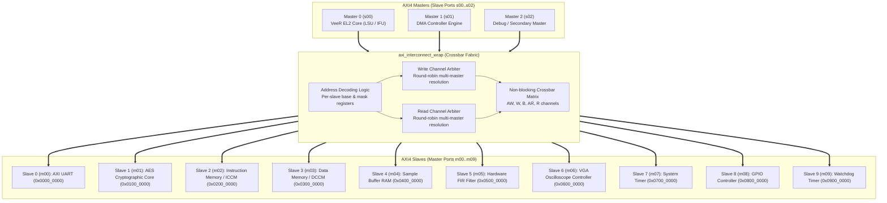

# AXI4 Crossbar Interconnect IP

[](#architecture-overview)
[](#topologies-and-wrappers)
[
[](axi_interconnect.v)

> **Navigation:** [Root README](../../README.md) &nbsp;|&nbsp; [RTL Overview](../README.md) &nbsp;|&nbsp; [VeeR EL2 Core](../veer_el2/README.md) &nbsp;|&nbsp; [AXI UART](../axi_uart/README.md) &nbsp;|&nbsp; [AES Core](../aes_core-master/README.md)

---

## 1. Overview

The **AXI4 Interconnect IP** provides the high-bandwidth, low-latency crossbar fabric connecting multiple AXI bus masters (such as the VeeR EL2 RISC-V core instruction and data ports, DMA controller, and external debug module) to system memories and memory-mapped peripheral slaves.

Built on Alex Forencich's parameterizable open-source AXI fabric, this module provides non-blocking concurrent crossbar switching for read and write channels, fair round-robin arbitration, address boundary decoding, and transaction ID tracking.

### Key Features

- **Concurrent Non-Blocking Crossbar:** Separate, independent address, data, and response routing for read and write channels. Multiple masters can access distinct slaves simultaneously without stalling.
- **Configurable Port Topology:** Parameterized master (`S_COUNT`) and slave (`M_COUNT`) interfaces with ready-to-use wrappers for **3-Master x 10-Slave** (`axi_interconnect_wrap_3x10.v`) and **3-Master x 14-Slave** (`axi_interconnect_wrap_3x14.v`).
- **Fair Round-Robin Arbitration:** Integrated arbiter logic (`arbiter.v` and `priority_encoder.v`) prevents bus starvation under heavy contention.
- **AXI4 Protocol Conformance:** Full support for burst transfers (INCR, WRAP, FIXED), narrow transfers, byte strobes (`wstrb`), and user sideband signals.
- **Automatic Code Generation:** Includes `scripts/axi_interconnect_wrap.py` script for templated generation of arbitrary $M \times N$ configurations using Jinja2.

---

## 2. Crossbar Topology Diagram



---

## 3. Module Hierarchy & File Organization

The interconnect files are located in `rtl/interconnect/`:

```
honours_project_soc-main/rtl/interconnect/
├── arbiter.v                      # Round-robin and priority arbitration engine
├── priority_encoder.v             # Combinational priority encoder
├── axi_interconnect.v             # Parameterized core crossbar matrix
├── axi_interconnect_wrap_3x10.v   # 3-Master x 10-Slave instantiation wrapper
├── axi_interconnect_wrap_3x14.v   # 3-Master x 14-Slave instantiation wrapper
├── axi_adapter.v                  # Top-level AXI bus width & protocol adapter
├── axi_adapter_rd.v               # Read-channel burst & width converter
└── axi_adapter_wr.v               # Write-channel burst & width converter
```

---

## 4. Port Specifications

### 4.1 Master-Facing Ports (Slaves `s00`, `s01`, `s02`)

Each master connects to a full set of 5 AXI4 channels:

| Channel | Signal Group | Width | Description |
|---|---|---|---|
| **Write Address** | `s_axi_awaddr`, `s_axi_awvalid`, `s_axi_awready`, `s_axi_awid`, `s_axi_awlen`, `s_axi_awsize`, `s_axi_awburst` | 32, 1, 1, ID, 8, 3, 2 | Target address and burst control |
| **Write Data** | `s_axi_wdata`, `s_axi_wstrb`, `s_axi_wlast`, `s_axi_wvalid`, `s_axi_wready` | 32, 4, 1, 1, 1 | Write data payload and byte enables |
| **Write Response** | `s_axi_bresp`, `s_axi_bid`, `s_axi_bvalid`, `s_axi_bready` | 2, ID, 1, 1 | Handshake completion and response code |
| **Read Address** | `s_axi_araddr`, `s_axi_arvalid`, `s_axi_arready`, `s_axi_arid`, `s_axi_arlen`, `s_axi_arsize`, `s_axi_arburst` | 32, 1, 1, ID, 8, 3, 2 | Read target address and burst length |
| **Read Data** | `s_axi_rdata`, `s_axi_rresp`, `s_axi_rid`, `s_axi_rlast`, `s_axi_rvalid`, `s_axi_rready` | 32, 2, ID, 1, 1, 1 | Read data word and error response |

### 4.2 Slave-Facing Ports (`m00` to `m09` / `m13`)

Each downstream slave port exposes matching AXI4 master signals routed directly to the selected peripheral interface.

---

## 5. Memory Map Decoding Parameters

In `axi_interconnect_uart_top.v` and `axi_interconnect_wrap_3x10.v`, each slave port's address region is configured via module parameters:

| Port | Peripheral Mapped | Base Address (`BASE_ADDR`) | Address Window (`ADDR_WIDTH`) | Read Conn | Write Conn |
|---|---|---|---|---|---|
| **`m00`** | **AXI UART** | `0x0000_0000` | 24-bit (16 MB) | All (3'b111) | All (3'b111) |
| **`m01`** | **AES Core** | `0x0100_0000` | 24-bit (16 MB) | All (3'b111) | All (3'b111) |
| **`m02`** | Instruction RAM (IMEM) | `0x0200_0000` | 24-bit (16 MB) | All (3'b111) | All (3'b111) |
| **`m03`** | Data RAM (DMEM) | `0x0300_0000` | 24-bit (16 MB) | All (3'b111) | All (3'b111) |
| **`m04`** | Sample Buffer | `0x0400_0000` | 24-bit (16 MB) | All (3'b111) | All (3'b111) |
| **`m05`** | FIR Filter | `0x0500_0000` | 24-bit (16 MB) | All (3'b111) | All (3'b111) |
| **`m06`** | VGA Controller | `0x0600_0000` | 24-bit (16 MB) | All (3'b111) | All (3'b111) |
| **`m07`** | System Timer | `0x0700_0000` | 24-bit (16 MB) | All (3'b111) | All (3'b111) |
| **`m08`** | GPIO | `0x0800_0000` | 24-bit (16 MB) | All (3'b111) | All (3'b111) |
| **`m09`** | Watchdog Timer | `0x0900_0000` | 24-bit (16 MB) | All (3'b111) | All (3'b111) |

---

## 6. Wrapper Generation Script

To regenerate wrappers with customized port counts, use the Python generator script located in `scripts/`:

```bash
# Example: Generate a 3-Master x 10-Slave wrapper
python3 scripts/axi_interconnect_wrap.py -p 3 10 -n axi_interconnect_wrap_3x10 -o rtl/interconnect/axi_interconnect_wrap_3x10.v

# Example: Generate a 3-Master x 14-Slave wrapper
python3 scripts/axi_interconnect_wrap.py -p 3 14 -n axi_interconnect_wrap_3x14 -o rtl/interconnect/axi_interconnect_wrap_3x14.v
```

---

## 7. Verification & Testbenches

The interconnect IP is verified using dedicated SystemVerilog testbenches located in `tb/`:

1. **`tb_axi_interconnect_wrap_3x14.sv`:**
   - 3-Master to 14-Slave routing and address boundary tests.
   - Concurrent read and write stress testing with simulated random slave response latencies.
   - Master contention arbitration check: tests equal round-robin bandwidth sharing under full load.
   - Execution command: `make interconnect` or `make run TEST=interconnect`.

2. **`tb_axi_interconnect_uart_top.sv`:**
   - End-to-end integration test verifying multi-master CPU/DMA transactions through the interconnect into the AXI UART peripheral.
   - Execution command: `make uart` or `make run TEST=uart`.

---

## 8. Related Documentation

- [Root README](../../README.md) — Complete SoC Architecture & System Overview
- [RTL Subsystem Hub](../README.md) — Subsystem Top-Level & Integration Details
- [VeeR EL2 Core README](../veer_el2/README.md) — RISC-V Processor Core
- [AXI UART README](../axi_uart/README.md) — AXI4-Lite UART Core
- [AES Core README](../aes_core-master/README.md) — AES Cryptographic Accelerator

---

## 9. Third-Party IP Provenance & Attribution

- **IP Core Name**: AXI4 Crossbar Interconnect (`axi_interconnect`, `arbiter`, `priority_encoder`, `axi_adapter`)
- **Original Author**: Alex Forencich (<alex@alexforencich.com>)
- **Upstream Repository**: [https://github.com/alexforencich/verilog-axi](https://github.com/alexforencich/verilog-axi)
- **License**: BSD 2-Clause License
- **Integration Role**: Serves as the central multi-master bus crossbar. The 3x10 and 3x14 parameterized wrapper modules (`axi_interconnect_wrap_3x10.v` and `axi_interconnect_wrap_3x14.v`) were templated using [`scripts/axi_interconnect_wrap.py`](../../scripts/axi_interconnect_wrap.py).
