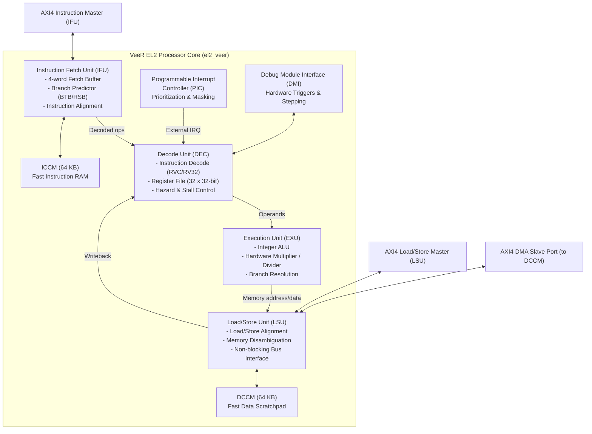
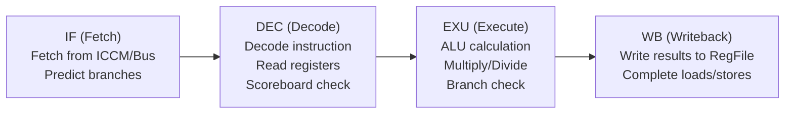

# VeeR EL2 RISC-V Processor Core IP

[](#architecture-overview)
[](#pipeline-stages)
[
[](https://www.apache.org/licenses/LICENSE-2.0)

> **Navigation:** [Root README](../../README.md) &nbsp;|&nbsp; [RTL Overview](../README.md) &nbsp;|&nbsp; [AXI Interconnect](../interconnect/README.md) &nbsp;|&nbsp; [AXI UART](../axi_uart/README.md) &nbsp;|&nbsp; [AES Core](../aes_core-master/README.md)

---

## 1. Overview

The **VeeR EL2** (formerly Western Digital SweRV Core EL2, maintained under CHIPS Alliance) is an ultra-compact, high-performance 32-bit RISC-V processor core designed for embedded control and sequencing tasks. In this SoC, the VeeR EL2 serves as the central control unit: it executes firmware out of tightly-coupled instruction memory, configures peripherals over the AXI interconnect, handles interrupts, and performs signal measurement computations (Peak-to-Peak, RMS, Frequency estimation) while dedicated hardware moves and processes streaming sample data.

### Key Specifications

| Parameter | Specification | Details |
|---|---|---|
| **ISA** | RV32IMC | Base integer (32-bit) + Multiplication/Division (M) + Compressed 16-bit instructions (C) |
| **Privilege Modes** | Machine (M) & User (U) | Full hardware privilege separation |
| **Pipeline Depth** | 4 Stages | Fetch (IF), Decode/Register Read (DEC), Execute (EXU), Writeback (WB) |
| **Execution Type** | In-order, single-issue | Deterministic latency, low power consumption |
| **Branch Predictor** | Dynamic Gshare | Branch Target Buffer (BTB), Direction Predictor, Return Stack Buffer (RSB) |
| **Tightly-Coupled Memories** | ICCM & DCCM | Configurable sizes (up to 512 KB), single-cycle access latency |
| **Bus Interfaces** | AXI4 / AHB-Lite | Master ports for instruction fetch, data load/store, and DMA access to DCCM/ICCM |
| **Interrupt Controller** | Integrated PIC | Programmable Interrupt Controller supporting up to 255 external interrupts |
| **Debug Interface** | DMI / JTAG | RISC-V Debug Specification 0.13 compliant with hardware triggers |

---

## 2. Block Diagram



---

## 3. Pipeline Stages

The VeeR EL2 core utilizes an optimized 4-stage in-order pipeline designed for maximum frequency and IPC:



1. **Instruction Fetch (IF):** Fetches up to 32 bits of instruction per cycle from the ICCM or via the AXI Instruction Master. Includes 16-bit compressed instruction (RVC) decompressor and dynamic branch prediction.
2. **Decode (DEC):** Decodes RV32IMC instructions, detects operand hazards, manages register renaming/forwarding paths, reads the 32-entry integer register file, and generates execution micro-operations.
3. **Execute (EXU):** Single-cycle integer ALU operations, multi-cycle radix-4 hardware integer multiplication and non-restoring division, branch condition evaluation, and jump target validation.
4. **Load/Store / Writeback (WB):** Computes effective memory addresses, executes single-cycle access to the DCCM, dispatches uncached load/store operations to the AXI bus interface, and retires completed instructions into the architectural register file.

---

## 4. Directory Structure

The core is organized into modular design units located under `rtl/veer_el2/`:

```
honours_project_soc-main/rtl/veer_el2/
├── configs/                      # Configuration scripts and templates
│   ├── README.md                 # Configuration documentation
│   ├── veer.config               # Parameterized configuration script
│   └── veer_config_gen.py        # Snapshot generator
├── design/                       # Synthesizable SystemVerilog RTL
│   ├── dbg/                      # Debug Module (DMI, registers, triggers)
│   ├── dec/                      # Decode, Register File, Exception Logic
│   ├── dmi/                      # Debug Module Interface protocol converters
│   ├── exu/                      # Execution unit (ALU, Multiplier, Divider)
│   ├── ifu/                      # Instruction Fetch & Branch Predictor
│   ├── include/                  # Global parameter and macro definition headers
│   ├── lib/                      # Clock gating, memory primitives, parity blocks
│   ├── lsu/                      # Load/Store Unit and memory interfaces
│   ├── el2_veer.sv               # Core top-level module
│   ├── el2_veer_wrapper.sv       # Bus interface and integration wrapper
│   ├── el2_mem.sv                # DCCM/ICCM SRAM behavioral models
│   ├── el2_pic_ctrl.sv           # Programmable Interrupt Controller (PIC)
│   └── flist                     # RTL compile filelist
└── snapshots/                    # Generated configuration snapshots
    └── default/                  # Default SoC configuration snapshot
        ├── common_defines.vh     # Synthesis and simulation macros
        ├── defines.h             # C header for firmware compilation
        ├── el2_param.vh          # Core parameter configuration
        └── link.ld               # GNU Linker script matching memory map
```

---

## 5. Bus & Memory Interface

In this SoC design, the VeeR EL2 core interfaces to the memory system and peripherals via the **Alex Forencich AXI4 Interconnect**:

- **Instruction Fetch Master:** Driven by `IFU`, connected to interconnect master port `s00`. Fetches code from Instruction Memory (`imem`) at `0x0000_0000`.
- **Data Load/Store Master:** Driven by `LSU`, connected to interconnect master port `s00` or `s01`. Reads/writes Data Memory (`dmem` at `0x0001_0000`), Sample Buffer (`0x0002_0000`), and memory-mapped control/status registers (`0x8000_0000` to `0x8000_6FFF`).
- **ICCM (Instruction Closely-Coupled Memory):** 64 KB single-cycle zero-wait-state instruction RAM located at `0xEE00_0000`.
- **DCCM (Data Closely-Coupled Memory):** 64 KB single-cycle zero-wait-state data RAM located at `0xF004_0000`.

---

## 6. Interrupt Handling & PIC

The VeeR EL2 includes an integrated **Programmable Interrupt Controller (PIC)** capable of routing internal core timer interrupts, software interrupts, and external peripheral interrupts:

- **Interrupt Lines:** Peripheral interrupts from UART (`irq_uart`), Timer (`irq_timer`), GPIO (`irq_gpio`), DMA (`irq_dma_done`, `irq_dma_err`), VGA (`irq_vga_frame`), and FIR (`irq_fir`) are routed to the PIC inputs.
- **Priority & Masking:** Each interrupt source possesses a configurable priority register (0–15) and individual enable bit.
- **Non-Maskable Interrupt (NMI):** Dedicated hardware pin `nmi_pin` connected to the Watchdog Timer `nmi_prewarn` signal to guarantee fail-safe trap execution before fatal system reset.

---

## 7. Firmware Verification Programs

Pre-compiled benchmark and verification hex binaries are available in `tb/hex/user_mode0/` and `tb/hex/user_mode1/` for core functional verification:

| Hex File | Test Description |
|---|---|
| `hello_world.hex` | Basic C runtime, printf over simulated console, and stack verification |
| `cmark.hex` | Standard EEMBC CoreMark benchmark running in user mode |
| `dhry.hex` | Dhrystone 2.1 benchmark measuring integer computational throughput |
| `csr_access.hex` | Control & Status Register read/write/set/clear compliance |
| `irq.hex` | External interrupt vectoring, preemption, and return from interrupt (mret) |
| `pmp.hex` | Physical Memory Protection region configuration and access fault traps |

---

## 8. Related Documentation

- [Root README](../../README.md) — Complete SoC Architecture & System Overview
- [RTL Subsystem Hub](../README.md) — RTL Hierarchy and Top-Level Wiring
- [AXI Interconnect README](../interconnect/README.md) — 3-Master x 10/14-Slave Bus Fabric
- [AXI UART README](../axi_uart/README.md) — Serial Interface Peripheral
- [AES Core README](../aes_core-master/README.md) — Cryptographic Hardware Accelerator

---

## 9. Third-Party IP Provenance & Attribution

- **IP Core Name**: VeeR EL2 RISC-V Processor Core (`el2_veer`)
- **Original Authors / Maintainers**: Western Digital / CHIPS Alliance
- **Upstream Repository**: [https://github.com/chipsalliance/Cores-VeeR-EL2](https://github.com/chipsalliance/Cores-VeeR-EL2)
- **License**: Apache License 2.0
- **Integration Role**: Serves as the primary 32-bit RISC-V host CPU core executing sequencing, peripheral configuration, and mathematical analysis. Configured with 64 KB ICCM and 64 KB DCCM snapshots in [`rtl/veer_el2/snapshots/default/`](snapshots/default/).
